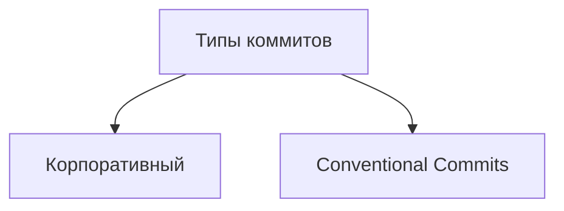

# Базовые команды в консоли (Git Bash)

### Навигация

- `pwd` (от англ. ***p**rint **w**orking **d**irectory*, «показать рабочую папку») — покажи, в какой я папке;
- `ls` (от англ. ***l**i**s**t directory contents*, «отобразить содержимое директории») — покажи файлы и папки в текущей папке;
- `ls -a` — покажи также скрытые файлы и папки, названия которых начинаются с символа `.`;
- `cd first-project` (от англ. ***c**hange **d**irectory*, «сменить директорию») — перейди в папку `first-project`;
- `cd first-project/html` — перейди в папку `html`, которая находится в папке `first-project`;
- `cd ..` — перейди на уровень выше, в родительскую папку;
- `cd ~` — перейди в домашнюю директорию (`/Users/Username`);
- `cd /` — перейди в корневую директорию.

### Работа с файлами и папками

**Создание**

- `touch index.html` (англ. *touch,* «коснуться») — создай файл `index.html` в текущей папке;
- `touch index.html style.css script.js` — если нужно создать сразу несколько файлов, можно напечатать их имена в одну строку через пробел;
- `mkdir second-project` (от англ. ***m**a**k**e **dir**ectory*, «создать директорию») — создай папку с именем `second-project` в текущей папке.

**Копирование и перемещение**

- `cp file.txt ~/my-dir` (от англ. ***c**o**p**y*, «копировать») — скопируй файл в другое место;
- `mv file.txt ~/my-dir` (от англ. ***m**o**v**e*, «переместить») — перемести файл или папку в другое место.

**Чтение**

- `cat file.txt` (от англ. *con**cat**enate and print*, «объединить и распечатать») — распечатай содержимое текстового файла `file.txt`.

**Удаление**

- `rm about.html` (от англ. ***r**e**m**ove*, «удалить») — удали файл `about.html`;
- `rmdir images` (от англ. ***r**e**m**ove **dir**ectory*, «удалить директорию») — удали папку `images`;
- `rm -r second-project` (от англ. ***r**e**m**ove,* «удалить» + ***r**ecursive*, «рекурсивный») — удали папку `second-project` и всё, что она содержит.

### Полезные возможности

- Команды необязательно печатать и выполнять по очереди. Можно указать их списком — разделить двумя амперсандами (`&&`).
- У консоли есть собственная память — буфер с несколькими последними командами. По ним можно перемещаться с помощью клавиш со стрелками вверх (**`↑`**) и вниз (**`↓`**).
- Чтобы не вводить название файла или папки полностью, можно набрать первые символы имени и дважды нажать `Tab`. Если файл или папка есть в текущей директории, командная строка допишет путь сама.
    
    Например, вы находитесь в папке `dev`. Начните вводить `cd first` и дважды нажмите `Tab`. Если папка `first-project` есть внутри `dev`, командная строка автоматически подставит её имя. Останется только нажать `Enter`.
    

**Сделать папку репозиторием — `git init`**

**«Разгитить» папку, если что-то пошло не так, — `rm -rf .git`**

- ключ `r` (от англ. ***r**ecursive* — «рекурсивно») позволяет удалять папки вместе с их содержимым;
- ключ `f` (от англ. ***f**orce* — «заставить») избавит вас от вопросов вроде «Вы точно хотите удалить этот файл? А этот? И этот тоже?».

**Проверить состояние репозитория — `git status`**

**Подготовить файлы к сохранению — `git add`**

- Ключ, или флаг, `--all` позволяет подготовить к сохранению все файлы в репозитории.
- Обратиться к текущей папке в Bash позволяет точка (`.`).

💡 **Чем отличается запоминание от сохранения?**

Команда `git add` не сохраняет содержимое файлов в репозитории. Само сохранение, или фиксацию состояния файлов, называют **коммитом** (от англ. *commit* — «совершать», «фиксировать»). «Сделать коммит» значит сохранить текущую версию файла.

Если провести аналогию, команду `git add` можно сравнить с добавлением товаров в корзину в интернет-магазине, а коммит — с оформлением и оплатой заказа.

- зелёным отмечена пустая версия файла — в таком виде он был во время последнего запуска команды `git add`;
- красным отмечена измененная версия файла

**Выполнить коммит — `git commit`**

- Сделать коммит можно командой `git commit` c ключом `-m` (от англ. ***m**essage* — «сообщение»), который присваивает коммиту сообщение.

Команда `git commit` выведет информацию о коммите.

- `[master (root-commit) baa3b6e]` значит:
    - коммит был в ветке `master`;
    - `root-commit` — это самый первый, или «корневой» (англ. *root*), коммит в ветке, у следующих коммитов такой надписи не будет;
    - `baa3b6e` — сокращённый идентификатор коммита (подробнее об этом мы ещё расскажем).
- `2 files changed, 1 insertion(+)` значит:
    - изменились два файла (`readme.txt` и `todo.txt`);
    - одна строка была добавлена (`1. Пройти пару уроков по Git.`).
- Строки вида `create mode 100644 readme.txt` — это более подробная информация о новых (добавленных в Git) файлах.
    - `create` (англ. «создать») говорит, что файл был создан. Если бы файл был удалён, на этом месте было бы слово `delete` (англ. «удалить»).
    - `mode 100644` сообщает, что это обычный файл. Также возможны варианты `100755` для исполняемых файлов (например, `что-нибудь.exe`) и `120000` для файлов-ссылок в Linux. Файлы-ссылки не содержат данных сами по себе, а только ссылаются на другие файлы — как «ярлыки» в Windows.
    
    ### Ещё раз о разнице между `git add` и `git commit`
    
    Сначала команда `git add` сообщает Git, какие именно файлы нужно сохранить и какую их версию. Затем с помощью команды `git commit` происходит само сохранение.
    
    В прошлом уроке мы сравнили `add` c добавлением товаров в корзину, а `commit` — с заказом. Теперь проведём ещё одну аналогию — с фотографией.
    
    Сначала вы просите друзей встать в ряд — это команда `git add`. И только после того, как все заняли свои места, поправили волосы и улыбнулись, вы нажимаете кнопку и делаете снимок — это команда `git commit`. Сам получившийся снимок и будет коммитом. В нашем случае на этой фотографии с обратной стороны ещё есть подпись «Мой первый коммит!».
    
    **Просмотреть историю коммитов — `git log`**
    
    ### Что такое SSH
    
    Когда компьютеры обмениваются данными в сети, они следуют **сетевым протоколам** (англ. *network protocols*) — правилам обмена данными между компьютерами.
    
    Один из наиболее распространённых сетевых протоколов — **SSH** (от англ. ***S**ecure **Sh**ell Protocol*). Он обеспечивает безопасный обмен данными в сети. С помощью этого протокола можно получать данные с удалённого компьютера или отправлять их на него. Трафик шифруется, поэтому протокол безопасен.
    
    SSH использует пару ключей для обеспечения безопасности — публичный и приватный:
    
    - **Приватный ключ** (англ. *private key*) хранится только на вашем компьютере и не должен передаваться кому-либо ещё. Он используется для расшифровки данных.
    - **Публичный ключ** (англ. *public key*) доступен всем и используется для шифрования данных. Они могут быть расшифрованы парным приватным ключом.
    
    Только вы можете расшифровать данные с помощью приватного ключа, но любой владелец публичного ключа может их для вас зашифровать. Эти два ключа связаны и образуют **SSH-пару**. В будущем вы наверняка будете использовать их для взаимодействия с GitHub и другими удалёнными серверами.
    
    Обычно SSH-ключи находятся в директории `.ssh/`. Проверить наличие этой директории и файлов в ней можно с помощью следующей команды.
    
    ```bash
    $ ls -la .ssh/ # вывели список созданных ключей
    ```
    
    ### **Инструкция по генерации SSH-ключа**
    
    1. Для **генерации SSH-пары** можно использовать программу `ssh-keygen`. Откройте терминал и введите следующую команду.
    
    Скопировать кодBASH
    
    ```bash
    $ ssh-keygen -t ed25519 -C "электронная почта, к которой привязан ваш аккаунт на GitHub"
    ```
    
    Используйте электронную почту, к которой привязан ваш GitHub-аккаунт.
    
    Если вы видите сообщение об ошибке, то, скорее всего, ваша система не поддерживает алгоритм шифрования `ed25519`. Ничего страшного: используйте другой алгоритм.
    
    ```bash
    $ ssh-keygen -t rsa -b 4096 -C "электронная почта, к которой привязан ваш аккаунт на GitHub"
    ```
    
    2. Укажите место хранения ключей. Простой вариант — сделать домашний каталог пользователя путём по умолчанию. Для этого нажмите `Enter`.
    
    **Windows**
    
    ```bash
    > Enter a file in which to save the key (C:\Users\<имя_пользователя>\.ssh\):[Press enter]
    ```
    
    Теперь в указанной директории появится пара ключей.
    
    1. Программа запросит **кодовую фразу** (англ. *passphrase*) для доступа к SSH-ключу. Вы можете оставить поле пустым. Для этого нажмите `Enter`, а затем ещё раз `Enter` для подтверждения.
    
    ```bash
    > Enter passphrase (empty for no passphrase): [Type a passphrase]
    > Enter same passphrase again: [Type passphrase again]
    ```
    
    ### Инструкция по связыванию SSH-ключа и GitHub-аккаунта
    
    1. После выполнения команды `ssh-keygen` из предыдущего урока в директории `~/.ssh` будет создано два файла — `id_ed25519` и `id_ed25519.pub` (или `id_rsa` и `id_rsa.pub` — в зависимости от того, какой алгоритм вы использовали):
        - `id_ed25519`/`id_rsa` — приватный ключ (файл без `.pub` в конце). Ни в коем случае не копируйте его и не делитесь им.
        - `id_ed25519.pub`/`id_rsa.pub` — публичный ключ (на это указывает расширение `.pub`).Скопируйте содержимое файла с публичным ключом в буфер обмена.
    
    **Windows**
    
    ```bash
    # скопировать содержимое ключа в буфер обмена:
    $ clip < ~/.ssh/id_rsa.pub
    # для ed25519:
    $ clip < ~/.ssh/id_ed25519.pub
    ```
    
    Если `clip` не сработает, выведите содержимое файла с помощью `cat ~/.ssh/id_rsa.pub` или `cat ~/.ssh/id_ed25519.pub` и скопируйте вывод в буфер обмена из консоли.
    
    1. Перейдите на GitHub и выберите пункт **Settings** (англ. «настройки») в меню аккаунта.
    2. В меню слева нажмите на пункт **SSH and GPG keys**.
    3. В открывшейся вкладке выберите **New SSH key** (англ. «новый SSH-ключ»).
    4. В поле **Title** (англ. «заголовок») напишите название ключа. Например, **Personal key** (англ. «личный ключ»).
    5. В поле **Key type** (англ. «тип ключа») должно быть **Authentication Key** (англ. «ключ аутентификации»).
    6. В поле **Key** скопируйте ваш ключ из буфера обмена.
    7. Нажмите на кнопку **Add SSH key** (англ. «добавить SSH-ключ»).
    8. Проверьте правильность ключа с помощью следующей команды.
    
    ```bash
    $ ssh -T [git@github.com](mailto:git@github.com)
    ```
    

**Привязать удалённый репозиторий к локальному — `git remote add`**

- Команде необходимо передать два параметра: имя удалённого репозитория и его URL.

**Убедиться, что репозитории связаны, — `git remote -v`**

- Флаг `-v` — короткая форма флага `--verbose` (англ. «подробный»). Он позволяет показать больше информации в выводе.

**Отправить изменения на удалённый репозиторий — `git push`**

В первый раз эту команду нужно вызвать с флагом `-u` и параметрами `origin` (имя удалённого репозитория) и `main` или `master` (название текущей ветки). Флаг `-u` свяжет локальную ветку с одноимённой удалённой. Как вы связывали локальный и удалённый репозитории в предыдущем уроке, так же и здесь нужно дополнительно связать ветки.

### Подробнее о том, зачем нужен **`README.md`**

Как правило, в `README.md` проекта можно найти следующую информацию:

1. Название проекта и его краткое описание: кем создан, для чего, какие решает задачи и какие закрывает проблемы.
2. Технологии, которые применяются в проекте. В чём его отличие от аналогичных.
3. Документация проекта — подробная инструкция о том, что представляет собой проект.
4. Планы проекта, если они есть.

Вот пример файла `README.md` для Git [на GitHub](https://github.com/git/git/blob/master/README.md).

# Оформление markdown

### Заголовки, абзацы и перенос

- **Заголовки** разных уровней создают решётками.

```markdown
# H1 — заголовок первого уровня, самый большой
## H2 — заголовок второго уровня, поменьше
### H3
#### H4
##### H5
###### H6 — заголовок шестого уровня, самый маленький
```

- Можно добавить **черту под заголовком или абзацем**.

```markdown
#### Заголовок 4

Текст над чертой

---

Текст под чертой
```

- Чтобы сделать **разрыв строки**, нужно поставить два пробела (в примере ниже они обозначены точками `⋅⋅`) или сочетание символов `<br>`.

```markdown

Текст до переноса⋅⋅
Текст после переноса <br>
Текст после второго переноса
```

- Чтобы начать **новый параграф**, в конце предыдущей строки должно стоять два символа переноса. Для этого нужно нажать `Enter` два раза.

```markdown
line

another line
```

Если сделать один перенос строки, как в примере ниже, и не поставить два пробела, текст сольётся в одну строку.

```markdown
line 
another line
```

### Выделение текста

- Чтобы выделить текст **курсивом** (`текст*`), его заключают в звёздочки (астериски) или нижние подчёркивания.

```markdown
Курсив — это *звёздочки* или _подчёркивания_.
```

- Чтобы выделить текст **полужирным шрифтом** (`*текст**`), его окружают двойными звёздочками или двойными нижними подчёркиваниями.

```markdown
Полужирный шрифт — двойные **звёздочки** или двойные __подчёркивания__.
Можно совместить выделение **звёздочки и _подчёркивания_**.
```

- Чтобы **зачеркнуть текст** (`~~текст~~`), его окружают двойными волнистыми линиями — тильдами.

```markdown
~~Зачёркнутый текст.~~
```

### Списки

- Для оформления **нумерованного списка** достаточно поставить в начало строки цифры с точкой.

```markdown
1. Первый пункт нумерованного списка.
2. Второй пункт.
```

- **Ненумерованный список** создаётся звёздочкой с пробелом в начале строки либо дефисом с пробелом.

```markdown
* первый пункт ненумерованного списка;
* второй пункт ненумерованного списка

- первый пункт ненумерованного списка;
- второй пункт ненумерованного списка
```

### **Ссылки**

- Чтобы сделать ссылкой часть текста, его заключают в квадратные скобки, а затем указывают нужный адрес в круглых скобках.

```markdown
[Яндекс](https://www.yandex.ru)
```

- Также можно добавить ссылке **тайтл** (от англ *title* — «название», «заголовок»). Тайтл — это всплывающая подсказка, которая появляется при наведении мыши на ссылку. Тайтл нужно заключить в кавычки и указать внутри скобок после адреса.

```markdown
[Яндекс](https://www.yandex.ru "Я Yandex!")
```

### **Код**

Чтобы оформить текст как код, нужно окружить его тройками косых кавычек — грависов. После первой тройки грависов указывают язык программирования, на котором написан код. В маркдауне есть поддержка синтаксиса почти всех популярных языков и инструментов.

```markdown
	```bash
	ls - la
	```

	```html
	<h1>А я просто текст</h1>
	```
```

Обратите внимание: вторая тройка тройных кавычек стоит на отдельной строке.

### **Элементы описания коммита**

После вызова `git log` появляется список коммитов.


Разберём элементы, из которых состоит описание:

- строка из цифр и латинских букв после слова **commit** — это хеш коммита;
- **Author** — имя автора и его электронная почта;
- **Date** — дата и время создания коммита;
- в конце находится сообщение коммита.

### **Получить сокращённый лог — `git log --oneline`**

Получить сокращённый лог можно с помощью команды `git log` с флагом `--oneline` (англ. «одной строкой»). В терминале появятся только первые несколько символов хеша каждого коммита и их комментарии.


Сокращённый лог полезен, если в репозитории уже много коммитов — например, сотни или тысячи. В этом случае можно быстро найти нужный по описанию.

Сокращённый хеш (то есть первые несколько символов полного) можно использовать точно так же, как и полный. Для этого команда `git log --oneline` автоматически подбирает такую длину сокращённых хешей, чтобы они были уникальными в пределах репозитория и Git всегда мог понять, о каком коммите идёт речь.

💡 Обратите внимание: если выход из просмотра логов не произошёл автоматически, нажмите клавишу `Q` (от англ. ***Q**uit —* «выйти») в английской раскладке клавиатуры.

### **Файл `HEAD`**

Файл `HEAD` (англ. «голова», «головной») — один из служебных файлов папки `.git`. Он указывает на коммит, который сделан последним (то есть на самый новый).

- Вместо хеша последнего коммита можно написать слово `HEAD` — Git вас поймёт.

## **Статусы файлов в Git**

### Статусы `untracked`/`tracked`, `staged` и `modified`

Одна из ключевых задач Git — отслеживать изменения файлов в репозитории. Для этого каждый файл помечается каким-либо статусом. Рассмотрим основные.

- **`untracked`** (англ. «неотслеживаемый»)
Мы говорили, что новые файлы в Git-репозитории помечаются как `untracked`, то есть неотслеживаемые. Git «видит», что такой файл существует, но не следит за изменениями в нём. У `untracked`файла нет предыдущих версий, зафиксированных в коммитах или через команду `git add`.
- **`staged`** (англ. «подготовленный»)
    
    После выполнения команды `git add` файл попадает в **staging area** (от англ. *stage* — «сцена», «этап [процесса]» и *area* — «область»), то есть в список файлов, которые войдут в коммит. В этот момент файл находится в состоянии `staged`.
    
    В одном из предыдущих уроков мы сравнили коммит с фотографией. Можно развить эту аналогию и сказать, что команда `git add` добавляет персонажей (текущее содержимое файла или нескольких файлов) на **сцену** (англ. *stage*) для общей фотографии, а `git commit` делает снимок всей сцены целиком.
    
    💡 **Staging area, index и cache**
    Staging area также называют **index** (англ. «каталог») или **cache** (англ. «кеш»), а состояние файла `staged` иногда называют `indexed` или `cached`.
    Все три варианта могут встречаться в документации и в качестве флагов команд Git. А также в интернете — например, в вопросах и ответах [на сайте Stack Overflow](https://stackoverflow.com/).
    
    
- **`tracked`** (англ. «отслеживаемый»)
Состояние `tracked` — это противоположность `untracked`. Оно довольно широкое по смыслу: в него попадают файлы, которые уже были зафиксированы с помощью `git commit`, а также файлы, которые были добавлены в staging area командой `git add`. То есть все файлы, в которых Git так или иначе отслеживает изменения.
- **`modified`** (англ. «изменённый»)
Состояние `modified` означает, что Git сравнил содержимое файла с последней сохранённой версией и нашёл отличия. Например, файл был закоммичен и после этого изменён.

💡 Для файлов в состояниях `staged` и `modified` обычно не указывают, что они также `tracked`, потому что это состояние подразумевается.

### Про `staged` и `modified`

Команда `git add` добавляет в staging area только текущее содержимое файла. Если вы, например, сделаете `git add file.txt`, а затем измените `file.txt`, то новое содержимое файла не будет находиться в staging.

Git сообщит об этом с помощью статуса `modified`: файл изменён относительно той версии, которая уже в staging. Чтобы добавить в staging последнюю версию, нужно выполнить `git add file.txt` ещё раз.

### Типичный жизненный цикл файла в Git

Может показаться, что файлы в репозитории попадают в разные состояния хаотично. На практике это не так, и у большинства файлов вполне предсказуемый путь.


1. Файл только что создали. Git про него ещё ничего не знает. Состояние: `untracked`.
2. Файл добавили в staging area с помощью `git add`. Состояние: `staged` (+ `tracked`).
    - Возможно, изменили файл ещё раз. Состояния: `staged`, `modified` (+ `tracked`).
    Обратите внимание: `staged` и `modified` у одного файла, но у разных его версий.
    - Ещё раз выполнили `git add`. Состояние: `staged` (+ `tracked`).
3. Сделали коммит с помощью `git commit`. Состояние: `tracked`.
4. Изменили файл. Состояние: `modified` (+ `tracked`).
5. Снова добавили в staging area с помощью `git add`. Состояния: `staged` (+ `tracked`).
6. Сделали коммит. Состояния: `tracked`.
7. Повторили пункты 4−7 много-много раз.

### Какие состояния показывает `git status`

Большинство файлов в типичном проекте будут находиться в состоянии `tracked` (то есть закоммичены и не изменены после коммита). Вы не увидите это состояние в выводе команды `git status` — иначе она бы каждый раз выводила список вообще всех файлов проекта.

В итоге `git status` показывает только следующие состояния файлов:

- `staged` (`Changes to be committed` в выводе `git status`);
- `modified` (`Changes not staged for commit`);
- `untracked` (`Untracked files`).

**Типичные варианты вывода `git status` :**

1. **Нет ни `staged`-, ни `modified`-, ни `untracked`-файлов.**

```bash
$ git status
On branch master
nothing to commit, working tree clean
```

2. **Найдены неотслеживаемые файлы.**

```bash
$ touch fileA.txt
$ git status
On branch master
Untracked files: # найдены неотслеживаемые файлы
  (use "git add <file>..." to include in what will be committed)
        fileA.txt

nothing added to commit but untracked files present (use "git add" to track)
```

<aside>
💡 Обратите внимание: в самом выводе `git status` есть подсказка, какую команду использовать, чтобы добавить файл в список на коммит: **Use** `git add <file>` **to include in what will be committed** (англ. «используйте `git add <file>`, чтобы добавить в список на коммит»).

</aside>

3. **Найдены изменения, которые не войдут в коммит**

```bash
# внесли в fileA.txt правки
# запросили статус
$ git status 
On branch master
Changes not staged for commit: # ещё одна секция
  (use "git add <file>..." to update what will be committed)
  (use "git restore <file>..." to discard changes in working directory)
        modified:   fileA.txt
```

4. **Файл добавлен в staging area, но после этого изменён**

```bash
# изменили fileA.txt
$ git status
On branch master
Changes to be committed:
  (use "git restore --staged <file>..." to unstage)
          modified:   fileA.txt

Changes not staged for commit:
  (use "git add <file>..." to update what will be committed)
  (use "git restore <file>..." to discard changes in working directory)
          modified:   fileA.txt
```

## Типы коммитов



- **Корпоративный**

В корпоративном стиле в начале сообщения обычно указывают Jira-ID, а после — текст сообщения.

```bash
$ git commit -m "LGS-239: Дополнить список пасхалок новыми числами"
```

- **Conventional Commits**

Стандарт **Conventional Commits** (англ. «соглашение о коммитах») отличается качественной документацией и подробной проработкой. Он подходит для репозиториев с исходным кодом программ. Использовать его для других типов проектов (например, для перевода книги) было бы неудобно.

Conventional Commits предлагает такой формат коммита: `<type>: <сообщение>`. Первая часть `type` — это тип изменений. Таких типов достаточно много. Вот два примера:

- `feat` (англ. «навык») — для новой функциональности;
- `fix` (от англ. «исправить», «устранить») — для исправленных ошибок.

💡 Более подробный список можно увидеть [на сайте с описанием этого стиля](https://www.conventionalcommits.org/ru/v1.0.0-beta.4/#%D1%81%D0%BF%D0%B5%D1%86%D0%B8%D1%84%D0%B8%D0%BA%D0%B0%D1%86%D0%B8%D1%8F).

Например, сообщение может быть таким.

```bash
git commit -m "feat: добавить подсчёт суммы заказов за неделю"
```

### GitHub-стиль

GitHub можно использовать не только для хранения файлов проекта, но и для ведения списка **задач** (англ. *issue*) этого проекта. Если коммит «закрывает» или «решает» какую-то задачу, то в его сообщении удобно указывать ссылку на неё. Для этого в любом месте сообщения нужно указать `#<номер задачи>`. Например, вот так.

```bash
$ git commit -m "Исправить #334, добавить график температуры"
```

В таком случае GitHub свяжет коммит и задачу.

💡 **Инфинитив и императив**
Для сообщений на русском языке часто рекомендуют использовать инфинитивы. Например: `Добавить тесты для PipkaService`, `Исправить ошибку #123` и так далее.
Для сообщений на английском рекомендуется использовать **повелительное наклонение** (англ. *imperative*). Например: `Use library mega_lib_300`, `Fix exit button` и так далее.
Эти рекомендации сложились исторически, и им следуют многие проекты.

# **Как исправить последний коммит**

**Дополнить коммит новыми файлами — `git commit --amend --no-edit`**

- Обратите внимание на опцию `--no-edit`. Она сообщает команде `commit`, что сообщение коммита нужно оставить как было.

Точно так же можно добавить не новый файл, а дополнительные изменения в уже добавленном в коммит файле.

```bash
*# ещё раз отредактировали main.html*

$ git add main.html *# добавили в список на коммит*
$ git commit --amend --no-edit
```

**Изменить сообщение коммита — `git commit --amend -m "Новое сообщение"`**

## Случилось страшное: открылся редактор

Если забыть указать у команды `git commit --amend` один из флагов (`--no-edit` или `-m`), Git предложит отредактировать сообщение коммита вручную. Для этого он откроет текстовый редактор, который установлен в системе по умолчанию. Чаще всего это либо **GNU nano**, либо **Vim**.

- ****nano — простой и свободный****
    
    Допустим, решили добавить в конце сообщения восклицательный знак. Чтобы сохранить новое сообщение, нужно нажать `Ctrl+X`, где `X` значит *e**x**it* (англ. «выход»).
    
    <aside>
    💡 В надписях вида `^X`, `^G` и других «шляпка» `^` обозначает кнопку `Ctrl`. То есть `^X` — это то же самое, что и `Ctrl+X`.
    
    </aside>
    
    После нажатия `Ctrl+X` nano предложит сохранить файл, для этого нужно нажать `Y` (от англ. ***y**es*).
    
    Затем редактор предложит изменить имя файла, но делать этого не нужно — просто нажмите `Enter`.
    
    После нажатия `Enter` редактор закроется, а Git изменит сообщение последнего коммита.
    
    <aside>
    💡 Если вы не хотите менять сообщение через редактор, можно выйти из него с помощью `Ctrl+X`, а затем выбрать `N` (от англ. ***n**o*). В таком случае редактор закроется, и Git оставит сообщение последнего коммита «как было».
    
    </aside>
    
- ****Vim — великий и ужасный****
    
    Если не откроется nano, то, скорее всего, откроется Vim.
    
    Если вы ещё не умеете пользоваться Vim, мы рекомендуем сразу выйти из редактора и использовать флаг `-m` для указания сообщений коммита. Вот как выйти из Vim:
    
    1. Нажмите клавишу `Esc`.
    2. Наберите последовательность символов `:qa!`.
    3. Нажмите `Enter`.
    

    <aside>
    💡 **Vimtutor**

    Редактор Vim — полезный инструмент, но его интерфейс сложно назвать интуитивным. И всё же во многих дистрибутивах это текстовый редактор по умолчанию. Если ваша текущая или будущая профессия связана с работой в консоли Linux, рекомендуем заглянуть в учебник по работе с Vim.
    Для запуска учебника на русском языке достаточно выполнить команду `vimtutor ru`. Без `ru` запустится английская версия.
    
    </aside>
    

# **Как откатиться назад, если «всё сломалось»**

- **Выполнить unstage изменений — `git restore --staged <file>`**
    
    Допустим, вы создали или изменили какой-то файл и добавили его в список «на коммит» (staging area) с помощью `git add`, но потом передумали включать его туда. Убрать файл из staging поможет команда `git restore --staged <file>` (от англ. *restore* — «восстановить»).
    
    Чтобы «сбросить» все файлы из `staged` обратно в `untracked`/`modified`, можно воспользоваться командой `git restore --staged .`: она сбросит всю текущую папку (`.`).
    
- **«Откатить» коммит — `git reset --hard <commit hash>`**
    
    Иногда нужно «откатить» то, что уже было закоммичено, то есть вернуть состояние репозитория к более раннему. Для этого используют команду `git reset --hard <commit hash>` (от англ. *reset*  — «сброс», «обнуление» и *hard* — «суровый»).
    
    ```bash
    $ git log --oneline # хеш можно найти в истории
    7b972f5 (HEAD -> master) style: добавить комментарии, расставить отступы
    b576d89 feat: добавить массив Expenses и цикл для добавления трат # вот сюда и вернёмся
    4b58962 refactor: разделить analyzeExpenses() на countSum() и saveExpenses()
    
    $ git reset --hard b576d89
    # теперь мы на этом коммите
    HEAD is now at b576d89 feat: добавить массив Expenses и цикл для добавления трат
    ```
    
    
    
- **«Откатить» изменения, которые не попали ни в staging, ни в коммит, — `git restore <file>`**

Может быть так, что вы случайно изменили файл, который не планировали. Теперь он отображается в `Changes not staged for commit` (`modified`). Чтобы вернуть всё «как было», можно выполнить команду `git restore <file>`.

Изменения в файле «откатятся» до последней версии, которая была сохранена через `git commit` или `git add`.