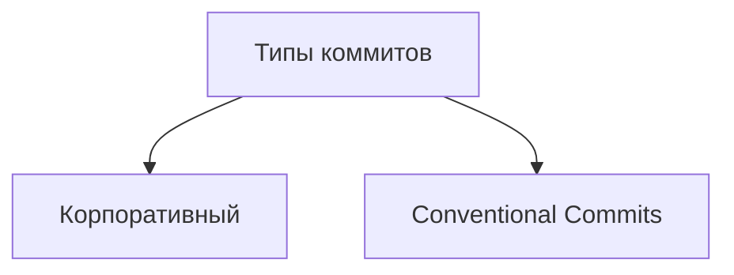

# Базовые команды в консоли (Git Bash)

### Навигация

- `pwd` (от англ. ***p**rint **w**orking **d**irectory*, «показать рабочую папку») — покажи, в какой я папке;
- `ls` (от англ. ***l**i**s**t directory contents*, «отобразить содержимое директории») — покажи файлы и папки в текущей папке;
- `ls -a` — покажи также скрытые файлы и папки, названия которых начинаются с символа `.`;
- `cd first-project` (от англ. ***c**hange **d**irectory*, «сменить директорию») — перейди в папку `first-project`;
- `cd first-project/html` — перейди в папку `html`, которая находится в папке `first-project`;
- `cd ..` — перейди на уровень выше, в родительскую папку;
- `cd ~` — перейди в домашнюю директорию (`/Users/Username`);
- `cd /` — перейди в корневую директорию.

### Работа с файлами и папками

**Создание**

- `touch index.html` (англ. *touch,* «коснуться») — создай файл `index.html` в текущей папке;
- `touch index.html style.css script.js` — если нужно создать сразу несколько файлов, можно напечатать их имена в одну строку через пробел;
- `mkdir second-project` (от англ. ***m**a**k**e **dir**ectory*, «создать директорию») — создай папку с именем `second-project` в текущей папке.

**Копирование и перемещение**

- `cp file.txt ~/my-dir` (от англ. ***c**o**p**y*, «копировать») — скопируй файл в другое место;
- `mv file.txt ~/my-dir` (от англ. ***m**o**v**e*, «переместить») — перемести файл или папку в другое место.

**Чтение**

- `cat file.txt` (от англ. *con**cat**enate and print*, «объединить и распечатать») — распечатай содержимое текстового файла `file.txt`.

**Удаление**

- `rm about.html` (от англ. ***r**e**m**ove*, «удалить») — удали файл `about.html`;
- `rmdir images` (от англ. ***r**e**m**ove **dir**ectory*, «удалить директорию») — удали папку `images`;
- `rm -r second-project` (от англ. ***r**e**m**ove,* «удалить» + ***r**ecursive*, «рекурсивный») — удали папку `second-project` и всё, что она содержит.

### Полезные возможности

- Команды необязательно печатать и выполнять по очереди. Можно указать их списком — разделить двумя амперсандами (`&&`).
- У консоли есть собственная память — буфер с несколькими последними командами. По ним можно перемещаться с помощью клавиш со стрелками вверх (**`↑`**) и вниз (**`↓`**).
- Чтобы не вводить название файла или папки полностью, можно набрать первые символы имени и дважды нажать `Tab`. Если файл или папка есть в текущей директории, командная строка допишет путь сама.
    
    Например, вы находитесь в папке `dev`. Начните вводить `cd first` и дважды нажмите `Tab`. Если папка `first-project` есть внутри `dev`, командная строка автоматически подставит её имя. Останется только нажать `Enter`.
    

**Сделать папку репозиторием — `git init`**

**«Разгитить» папку, если что-то пошло не так, — `rm -rf .git`**

- ключ `r` (от англ. ***r**ecursive* — «рекурсивно») позволяет удалять папки вместе с их содержимым;
- ключ `f` (от англ. ***f**orce* — «заставить») избавит вас от вопросов вроде «Вы точно хотите удалить этот файл? А этот? И этот тоже?».

**Проверить состояние репозитория — `git status`**

**Подготовить файлы к сохранению — `git add`**

- Ключ, или флаг, `--all` позволяет подготовить к сохранению все файлы в репозитории.
- Обратиться к текущей папке в Bash позволяет точка (`.`).

💡 **Чем отличается запоминание от сохранения?**

Команда `git add` не сохраняет содержимое файлов в репозитории. Само сохранение, или фиксацию состояния файлов, называют **коммитом** (от англ. *commit* — «совершать», «фиксировать»). «Сделать коммит» значит сохранить текущую версию файла.

Если провести аналогию, команду `git add` можно сравнить с добавлением товаров в корзину в интернет-магазине, а коммит — с оформлением и оплатой заказа.

- зелёным отмечена пустая версия файла — в таком виде он был во время последнего запуска команды `git add`;
- красным отмечена измененная версия файла

**Выполнить коммит — `git commit`**

- Сделать коммит можно командой `git commit` c ключом `-m` (от англ. ***m**essage* — «сообщение»), который присваивает коммиту сообщение.

Команда `git commit` выведет информацию о коммите.

- `[master (root-commit) baa3b6e]` значит:
    - коммит был в ветке `master`;
    - `root-commit` — это самый первый, или «корневой» (англ. *root*), коммит в ветке, у следующих коммитов такой надписи не будет;
    - `baa3b6e` — сокращённый идентификатор коммита (подробнее об этом мы ещё расскажем).
- `2 files changed, 1 insertion(+)` значит:
    - изменились два файла (`readme.txt` и `todo.txt`);
    - одна строка была добавлена (`1. Пройти пару уроков по Git.`).
- Строки вида `create mode 100644 readme.txt` — это более подробная информация о новых (добавленных в Git) файлах.
    - `create` (англ. «создать») говорит, что файл был создан. Если бы файл был удалён, на этом месте было бы слово `delete` (англ. «удалить»).
    - `mode 100644` сообщает, что это обычный файл. Также возможны варианты `100755` для исполняемых файлов (например, `что-нибудь.exe`) и `120000` для файлов-ссылок в Linux. Файлы-ссылки не содержат данных сами по себе, а только ссылаются на другие файлы — как «ярлыки» в Windows.
    
    ### Ещё раз о разнице между `git add` и `git commit`
    
    Сначала команда `git add` сообщает Git, какие именно файлы нужно сохранить и какую их версию. Затем с помощью команды `git commit` происходит само сохранение.
    
    В прошлом уроке мы сравнили `add` c добавлением товаров в корзину, а `commit` — с заказом. Теперь проведём ещё одну аналогию — с фотографией.
    
    Сначала вы просите друзей встать в ряд — это команда `git add`. И только после того, как все заняли свои места, поправили волосы и улыбнулись, вы нажимаете кнопку и делаете снимок — это команда `git commit`. Сам получившийся снимок и будет коммитом. В нашем случае на этой фотографии с обратной стороны ещё есть подпись «Мой первый коммит!».
    
    **Просмотреть историю коммитов — `git log`**
    
    ### Что такое SSH
    
    Когда компьютеры обмениваются данными в сети, они следуют **сетевым протоколам** (англ. *network protocols*) — правилам обмена данными между компьютерами.
    
    Один из наиболее распространённых сетевых протоколов — **SSH** (от англ. ***S**ecure **Sh**ell Protocol*). Он обеспечивает безопасный обмен данными в сети. С помощью этого протокола можно получать данные с удалённого компьютера или отправлять их на него. Трафик шифруется, поэтому протокол безопасен.
    
    SSH использует пару ключей для обеспечения безопасности — публичный и приватный:
    
    - **Приватный ключ** (англ. *private key*) хранится только на вашем компьютере и не должен передаваться кому-либо ещё. Он используется для расшифровки данных.
    - **Публичный ключ** (англ. *public key*) доступен всем и используется для шифрования данных. Они могут быть расшифрованы парным приватным ключом.
    
    Только вы можете расшифровать данные с помощью приватного ключа, но любой владелец публичного ключа может их для вас зашифровать. Эти два ключа связаны и образуют **SSH-пару**. В будущем вы наверняка будете использовать их для взаимодействия с GitHub и другими удалёнными серверами.
    
    Обычно SSH-ключи находятся в директории `.ssh/`. Проверить наличие этой директории и файлов в ней можно с помощью следующей команды.
    
    ```bash
    $ ls -la .ssh/ # вывели список созданных ключей
    ```
    
    ### **Инструкция по генерации SSH-ключа**
    
    1. Для **генерации SSH-пары** можно использовать программу `ssh-keygen`. Откройте терминал и введите следующую команду.
    
    Скопировать кодBASH
    
    ```bash
    $ ssh-keygen -t ed25519 -C "электронная почта, к которой привязан ваш аккаунт на GitHub"
    ```
    
    Используйте электронную почту, к которой привязан ваш GitHub-аккаунт.
    
    Если вы видите сообщение об ошибке, то, скорее всего, ваша система не поддерживает алгоритм шифрования `ed25519`. Ничего страшного: используйте другой алгоритм.
    
    ```bash
    $ ssh-keygen -t rsa -b 4096 -C "электронная почта, к которой привязан ваш аккаунт на GitHub"
    ```
    
    2. Укажите место хранения ключей. Простой вариант — сделать домашний каталог пользователя путём по умолчанию. Для этого нажмите `Enter`.
    
    **Windows**
    
    ```bash
    > Enter a file in which to save the key (C:\Users\<имя_пользователя>\.ssh\):[Press enter]
    ```
    
    Теперь в указанной директории появится пара ключей.
    
    1. Программа запросит **кодовую фразу** (англ. *passphrase*) для доступа к SSH-ключу. Вы можете оставить поле пустым. Для этого нажмите `Enter`, а затем ещё раз `Enter` для подтверждения.
    
    ```bash
    > Enter passphrase (empty for no passphrase): [Type a passphrase]
    > Enter same passphrase again: [Type passphrase again]
    ```
    
    ### Инструкция по связыванию SSH-ключа и GitHub-аккаунта
    
    1. После выполнения команды `ssh-keygen` из предыдущего урока в директории `~/.ssh` будет создано два файла — `id_ed25519` и `id_ed25519.pub` (или `id_rsa` и `id_rsa.pub` — в зависимости от того, какой алгоритм вы использовали):
        - `id_ed25519`/`id_rsa` — приватный ключ (файл без `.pub` в конце). Ни в коем случае не копируйте его и не делитесь им.
        - `id_ed25519.pub`/`id_rsa.pub` — публичный ключ (на это указывает расширение `.pub`).Скопируйте содержимое файла с публичным ключом в буфер обмена.
    
    **Windows**
    
    ```bash
    # скопировать содержимое ключа в буфер обмена:
    $ clip < ~/.ssh/id_rsa.pub
    # для ed25519:
    $ clip < ~/.ssh/id_ed25519.pub
    ```
    
    Если `clip` не сработает, выведите содержимое файла с помощью `cat ~/.ssh/id_rsa.pub` или `cat ~/.ssh/id_ed25519.pub` и скопируйте вывод в буфер обмена из консоли.
    
    1. Перейдите на GitHub и выберите пункт **Settings** (англ. «настройки») в меню аккаунта.
    2. В меню слева нажмите на пункт **SSH and GPG keys**.
    3. В открывшейся вкладке выберите **New SSH key** (англ. «новый SSH-ключ»).
    4. В поле **Title** (англ. «заголовок») напишите название ключа. Например, **Personal key** (англ. «личный ключ»).
    5. В поле **Key type** (англ. «тип ключа») должно быть **Authentication Key** (англ. «ключ аутентификации»).
    6. В поле **Key** скопируйте ваш ключ из буфера обмена.
    7. Нажмите на кнопку **Add SSH key** (англ. «добавить SSH-ключ»).
    8. Проверьте правильность ключа с помощью следующей команды.
    
    ```bash
    $ ssh -T [git@github.com](mailto:git@github.com)
    ```
    

**Привязать удалённый репозиторий к локальному — `git remote add`**

- Команде необходимо передать два параметра: имя удалённого репозитория и его URL.

**Убедиться, что репозитории связаны, — `git remote -v`**

- Флаг `-v` — короткая форма флага `--verbose` (англ. «подробный»). Он позволяет показать больше информации в выводе.

**Отправить изменения на удалённый репозиторий — `git push`**

В первый раз эту команду нужно вызвать с флагом `-u` и параметрами `origin` (имя удалённого репозитория) и `main` или `master` (название текущей ветки). Флаг `-u` свяжет локальную ветку с одноимённой удалённой. Как вы связывали локальный и удалённый репозитории в предыдущем уроке, так же и здесь нужно дополнительно связать ветки.

### Подробнее о том, зачем нужен **`README.md`**

Как правило, в `README.md` проекта можно найти следующую информацию:

1. Название проекта и его краткое описание: кем создан, для чего, какие решает задачи и какие закрывает проблемы.
2. Технологии, которые применяются в проекте. В чём его отличие от аналогичных.
3. Документация проекта — подробная инструкция о том, что представляет собой проект.
4. Планы проекта, если они есть.

Вот пример файла `README.md` для Git [на GitHub](https://github.com/git/git/blob/master/README.md).

# Оформление markdown

### Заголовки, абзацы и перенос

- **Заголовки** разных уровней создают решётками.

```markdown
# H1 — заголовок первого уровня, самый большой
## H2 — заголовок второго уровня, поменьше
### H3
#### H4
##### H5
###### H6 — заголовок шестого уровня, самый маленький
```

- Можно добавить **черту под заголовком или абзацем**.

```markdown
#### Заголовок 4

Текст над чертой

---

Текст под чертой
```

- Чтобы сделать **разрыв строки**, нужно поставить два пробела (в примере ниже они обозначены точками `⋅⋅`) или сочетание символов `<br>`.

```markdown

Текст до переноса⋅⋅
Текст после переноса <br>
Текст после второго переноса
```

- Чтобы начать **новый параграф**, в конце предыдущей строки должно стоять два символа переноса. Для этого нужно нажать `Enter` два раза.

```markdown
line

another line
```

Если сделать один перенос строки, как в примере ниже, и не поставить два пробела, текст сольётся в одну строку.

```markdown
line 
another line
```

### Выделение текста

- Чтобы выделить текст **курсивом** (`текст*`), его заключают в звёздочки (астериски) или нижние подчёркивания.

```markdown
Курсив — это *звёздочки* или _подчёркивания_.
```

- Чтобы выделить текст **полужирным шрифтом** (`*текст**`), его окружают двойными звёздочками или двойными нижними подчёркиваниями.

```markdown
Полужирный шрифт — двойные **звёздочки** или двойные __подчёркивания__.
Можно совместить выделение **звёздочки и _подчёркивания_**.
```

- Чтобы **зачеркнуть текст** (`~~текст~~`), его окружают двойными волнистыми линиями — тильдами.

```markdown
~~Зачёркнутый текст.~~
```

### Списки

- Для оформления **нумерованного списка** достаточно поставить в начало строки цифры с точкой.

```markdown
1. Первый пункт нумерованного списка.
2. Второй пункт.
```

- **Ненумерованный список** создаётся звёздочкой с пробелом в начале строки либо дефисом с пробелом.

```markdown
* первый пункт ненумерованного списка;
* второй пункт ненумерованного списка

- первый пункт ненумерованного списка;
- второй пункт ненумерованного списка
```

### **Ссылки**

- Чтобы сделать ссылкой часть текста, его заключают в квадратные скобки, а затем указывают нужный адрес в круглых скобках.

```markdown
[Яндекс](https://www.yandex.ru)
```

- Также можно добавить ссылке **тайтл** (от англ *title* — «название», «заголовок»). Тайтл — это всплывающая подсказка, которая появляется при наведении мыши на ссылку. Тайтл нужно заключить в кавычки и указать внутри скобок после адреса.

```markdown
[Яндекс](https://www.yandex.ru "Я Yandex!")
```

### **Код**

Чтобы оформить текст как код, нужно окружить его тройками косых кавычек — грависов. После первой тройки грависов указывают язык программирования, на котором написан код. В маркдауне есть поддержка синтаксиса почти всех популярных языков и инструментов.

```markdown
	```bash
	ls - la
	```

	```html
	<h1>А я просто текст</h1>
	```
```

Обратите внимание: вторая тройка тройных кавычек стоит на отдельной строке.

### **Элементы описания коммита**

После вызова `git log` появляется список коммитов.


Разберём элементы, из которых состоит описание:

- строка из цифр и латинских букв после слова **commit** — это хеш коммита;
- **Author** — имя автора и его электронная почта;
- **Date** — дата и время создания коммита;
- в конце находится сообщение коммита.

### **Получить сокращённый лог — `git log --oneline`**

Получить сокращённый лог можно с помощью команды `git log` с флагом `--oneline` (англ. «одной строкой»). В терминале появятся только первые несколько символов хеша каждого коммита и их комментарии.


Сокращённый лог полезен, если в репозитории уже много коммитов — например, сотни или тысячи. В этом случае можно быстро найти нужный по описанию.

Сокращённый хеш (то есть первые несколько символов полного) можно использовать точно так же, как и полный. Для этого команда `git log --oneline` автоматически подбирает такую длину сокращённых хешей, чтобы они были уникальными в пределах репозитория и Git всегда мог понять, о каком коммите идёт речь.

💡 Обратите внимание: если выход из просмотра логов не произошёл автоматически, нажмите клавишу `Q` (от англ. ***Q**uit —* «выйти») в английской раскладке клавиатуры.

### **Файл `HEAD`**

Файл `HEAD` (англ. «голова», «головной») — один из служебных файлов папки `.git`. Он указывает на коммит, который сделан последним (то есть на самый новый).

- Вместо хеша последнего коммита можно написать слово `HEAD` — Git вас поймёт.

## **Статусы файлов в Git**

### Статусы `untracked`/`tracked`, `staged` и `modified`

Одна из ключевых задач Git — отслеживать изменения файлов в репозитории. Для этого каждый файл помечается каким-либо статусом. Рассмотрим основные.

- **`untracked`** (англ. «неотслеживаемый»)
Мы говорили, что новые файлы в Git-репозитории помечаются как `untracked`, то есть неотслеживаемые. Git «видит», что такой файл существует, но не следит за изменениями в нём. У `untracked`файла нет предыдущих версий, зафиксированных в коммитах или через команду `git add`.
- **`staged`** (англ. «подготовленный»)
    
    После выполнения команды `git add` файл попадает в **staging area** (от англ. *stage* — «сцена», «этап [процесса]» и *area* — «область»), то есть в список файлов, которые войдут в коммит. В этот момент файл находится в состоянии `staged`.
    
    В одном из предыдущих уроков мы сравнили коммит с фотографией. Можно развить эту аналогию и сказать, что команда `git add` добавляет персонажей (текущее содержимое файла или нескольких файлов) на **сцену** (англ. *stage*) для общей фотографии, а `git commit` делает снимок всей сцены целиком.
    
    💡 **Staging area, index и cache**
    Staging area также называют **index** (англ. «каталог») или **cache** (англ. «кеш»), а состояние файла `staged` иногда называют `indexed` или `cached`.
    Все три варианта могут встречаться в документации и в качестве флагов команд Git. А также в интернете — например, в вопросах и ответах [на сайте Stack Overflow](https://stackoverflow.com/).
    
    
- **`tracked`** (англ. «отслеживаемый»)
Состояние `tracked` — это противоположность `untracked`. Оно довольно широкое по смыслу: в него попадают файлы, которые уже были зафиксированы с помощью `git commit`, а также файлы, которые были добавлены в staging area командой `git add`. То есть все файлы, в которых Git так или иначе отслеживает изменения.
- **`modified`** (англ. «изменённый»)
Состояние `modified` означает, что Git сравнил содержимое файла с последней сохранённой версией и нашёл отличия. Например, файл был закоммичен и после этого изменён.

💡 Для файлов в состояниях `staged` и `modified` обычно не указывают, что они также `tracked`, потому что это состояние подразумевается.

### Про `staged` и `modified`

Команда `git add` добавляет в staging area только текущее содержимое файла. Если вы, например, сделаете `git add file.txt`, а затем измените `file.txt`, то новое содержимое файла не будет находиться в staging.

Git сообщит об этом с помощью статуса `modified`: файл изменён относительно той версии, которая уже в staging. Чтобы добавить в staging последнюю версию, нужно выполнить `git add file.txt` ещё раз.

### Типичный жизненный цикл файла в Git

Может показаться, что файлы в репозитории попадают в разные состояния хаотично. На практике это не так, и у большинства файлов вполне предсказуемый путь.


1. Файл только что создали. Git про него ещё ничего не знает. Состояние: `untracked`.
2. Файл добавили в staging area с помощью `git add`. Состояние: `staged` (+ `tracked`).
    - Возможно, изменили файл ещё раз. Состояния: `staged`, `modified` (+ `tracked`).
    Обратите внимание: `staged` и `modified` у одного файла, но у разных его версий.
    - Ещё раз выполнили `git add`. Состояние: `staged` (+ `tracked`).
3. Сделали коммит с помощью `git commit`. Состояние: `tracked`.
4. Изменили файл. Состояние: `modified` (+ `tracked`).
5. Снова добавили в staging area с помощью `git add`. Состояния: `staged` (+ `tracked`).
6. Сделали коммит. Состояния: `tracked`.
7. Повторили пункты 4−7 много-много раз.

### Какие состояния показывает `git status`

Большинство файлов в типичном проекте будут находиться в состоянии `tracked` (то есть закоммичены и не изменены после коммита). Вы не увидите это состояние в выводе команды `git status` — иначе она бы каждый раз выводила список вообще всех файлов проекта.

В итоге `git status` показывает только следующие состояния файлов:

- `staged` (`Changes to be committed` в выводе `git status`);
- `modified` (`Changes not staged for commit`);
- `untracked` (`Untracked files`).

**Типичные варианты вывода `git status` :**

1. **Нет ни `staged`-, ни `modified`-, ни `untracked`-файлов.**

```bash
$ git status
On branch master
nothing to commit, working tree clean
```

2. **Найдены неотслеживаемые файлы.**

```bash
$ touch fileA.txt
$ git status
On branch master
Untracked files: # найдены неотслеживаемые файлы
  (use "git add <file>..." to include in what will be committed)
        fileA.txt

nothing added to commit but untracked files present (use "git add" to track)
```

<aside>
💡 Обратите внимание: в самом выводе `git status` есть подсказка, какую команду использовать, чтобы добавить файл в список на коммит: **Use** `git add <file>` **to include in what will be committed** (англ. «используйте `git add <file>`, чтобы добавить в список на коммит»).

</aside>

3. **Найдены изменения, которые не войдут в коммит**

```bash
# внесли в fileA.txt правки
# запросили статус
$ git status 
On branch master
Changes not staged for commit: # ещё одна секция
  (use "git add <file>..." to update what will be committed)
  (use "git restore <file>..." to discard changes in working directory)
        modified:   fileA.txt
```

4. **Файл добавлен в staging area, но после этого изменён**

```bash
# изменили fileA.txt
$ git status
On branch master
Changes to be committed:
  (use "git restore --staged <file>..." to unstage)
          modified:   fileA.txt

Changes not staged for commit:
  (use "git add <file>..." to update what will be committed)
  (use "git restore <file>..." to discard changes in working directory)
          modified:   fileA.txt
```

## Типы коммитов



- **Корпоративный**

В корпоративном стиле в начале сообщения обычно указывают Jira-ID, а после — текст сообщения.

```bash
$ git commit -m "LGS-239: Дополнить список пасхалок новыми числами"
```

- **Conventional Commits**

Стандарт **Conventional Commits** (англ. «соглашение о коммитах») отличается качественной документацией и подробной проработкой. Он подходит для репозиториев с исходным кодом программ. Использовать его для других типов проектов (например, для перевода книги) было бы неудобно.

Conventional Commits предлагает такой формат коммита: `<type>: <сообщение>`. Первая часть `type` — это тип изменений. Таких типов достаточно много. Вот два примера:

- `feat` (англ. «навык») — для новой функциональности;
- `fix` (от англ. «исправить», «устранить») — для исправленных ошибок.

💡 Более подробный список можно увидеть [на сайте с описанием этого стиля](https://www.conventionalcommits.org/ru/v1.0.0-beta.4/#%D1%81%D0%BF%D0%B5%D1%86%D0%B8%D1%84%D0%B8%D0%BA%D0%B0%D1%86%D0%B8%D1%8F).

Например, сообщение может быть таким.

```bash
git commit -m "feat: добавить подсчёт суммы заказов за неделю"
```

### GitHub-стиль

GitHub можно использовать не только для хранения файлов проекта, но и для ведения списка **задач** (англ. *issue*) этого проекта. Если коммит «закрывает» или «решает» какую-то задачу, то в его сообщении удобно указывать ссылку на неё. Для этого в любом месте сообщения нужно указать `#<номер задачи>`. Например, вот так.

```bash
$ git commit -m "Исправить #334, добавить график температуры"
```

В таком случае GitHub свяжет коммит и задачу.

💡 **Инфинитив и императив**
Для сообщений на русском языке часто рекомендуют использовать инфинитивы. Например: `Добавить тесты для PipkaService`, `Исправить ошибку #123` и так далее.
Для сообщений на английском рекомендуется использовать **повелительное наклонение** (англ. *imperative*). Например: `Use library mega_lib_300`, `Fix exit button` и так далее.
Эти рекомендации сложились исторически, и им следуют многие проекты.

# **Как исправить последний коммит**

**Дополнить коммит новыми файлами — `git commit --amend --no-edit`**

- Обратите внимание на опцию `--no-edit`. Она сообщает команде `commit`, что сообщение коммита нужно оставить как было.

Точно так же можно добавить не новый файл, а дополнительные изменения в уже добавленном в коммит файле.

```bash
*# ещё раз отредактировали main.html*

$ git add main.html *# добавили в список на коммит*
$ git commit --amend --no-edit
```

**Изменить сообщение коммита — `git commit --amend -m "Новое сообщение"`**

## Случилось страшное: открылся редактор

Если забыть указать у команды `git commit --amend` один из флагов (`--no-edit` или `-m`), Git предложит отредактировать сообщение коммита вручную. Для этого он откроет текстовый редактор, который установлен в системе по умолчанию. Чаще всего это либо **GNU nano**, либо **Vim**.

- ****nano — простой и свободный****
    
    Допустим, решили добавить в конце сообщения восклицательный знак. Чтобы сохранить новое сообщение, нужно нажать `Ctrl+X`, где `X` значит *e**x**it* (англ. «выход»).
    
    <aside>
    💡 В надписях вида `^X`, `^G` и других «шляпка» `^` обозначает кнопку `Ctrl`. То есть `^X` — это то же самое, что и `Ctrl+X`.
    
    </aside>
    
    После нажатия `Ctrl+X` nano предложит сохранить файл, для этого нужно нажать `Y` (от англ. ***y**es*).
    
    Затем редактор предложит изменить имя файла, но делать этого не нужно — просто нажмите `Enter`.
    
    После нажатия `Enter` редактор закроется, а Git изменит сообщение последнего коммита.
    
    <aside>
    💡 Если вы не хотите менять сообщение через редактор, можно выйти из него с помощью `Ctrl+X`, а затем выбрать `N` (от англ. ***n**o*). В таком случае редактор закроется, и Git оставит сообщение последнего коммита «как было».
    
    </aside>
    
- ****Vim — великий и ужасный****
    
    Если не откроется nano, то, скорее всего, откроется Vim.
    
    Если вы ещё не умеете пользоваться Vim, мы рекомендуем сразу выйти из редактора и использовать флаг `-m` для указания сообщений коммита. Вот как выйти из Vim:
    
    1. Нажмите клавишу `Esc`.
    2. Наберите последовательность символов `:qa!`.
    3. Нажмите `Enter`.
    

    <aside>
    💡 **Vimtutor**

    Редактор Vim — полезный инструмент, но его интерфейс сложно назвать интуитивным. И всё же во многих дистрибутивах это текстовый редактор по умолчанию. Если ваша текущая или будущая профессия связана с работой в консоли Linux, рекомендуем заглянуть в учебник по работе с Vim.
    Для запуска учебника на русском языке достаточно выполнить команду `vimtutor ru`. Без `ru` запустится английская версия.
    
    </aside>
    

# **Как откатиться назад, если «всё сломалось»**

- **Выполнить unstage изменений — `git restore --staged <file>`**
    
    Допустим, вы создали или изменили какой-то файл и добавили его в список «на коммит» (staging area) с помощью `git add`, но потом передумали включать его туда. Убрать файл из staging поможет команда `git restore --staged <file>` (от англ. *restore* — «восстановить»).
    
    Чтобы «сбросить» все файлы из `staged` обратно в `untracked`/`modified`, можно воспользоваться командой `git restore --staged .`: она сбросит всю текущую папку (`.`).
    
- **«Откатить» коммит — `git reset --hard <commit hash>`**
    
    Иногда нужно «откатить» то, что уже было закоммичено, то есть вернуть состояние репозитория к более раннему. Для этого используют команду `git reset --hard <commit hash>` (от англ. *reset*  — «сброс», «обнуление» и *hard* — «суровый»).
    
    ```bash
    $ git log --oneline # хеш можно найти в истории
    7b972f5 (HEAD -> master) style: добавить комментарии, расставить отступы
    b576d89 feat: добавить массив Expenses и цикл для добавления трат # вот сюда и вернёмся
    4b58962 refactor: разделить analyzeExpenses() на countSum() и saveExpenses()
    
    $ git reset --hard b576d89
    # теперь мы на этом коммите
    HEAD is now at b576d89 feat: добавить массив Expenses и цикл для добавления трат
    ```
    
    
    
- **«Откатить» изменения, которые не попали ни в staging, ни в коммит, — `git restore <file>`**

Может быть так, что вы случайно изменили файл, который не планировали. Теперь он отображается в `Changes not staged for commit` (`modified`). Чтобы вернуть всё «как было», можно выполнить команду `git restore <file>`.

Изменения в файле «откатятся» до последней версии, которая была сохранена через `git commit` или `git add`.

# **Просматриваем изменения в файлах**

При работе с Git часто нужно узнать, что конкретно изменится или уже изменилось после того или иного коммита. Вот примеры таких ситуаций:

- Вы собираетесь сделать коммит, но хотите проверить (или перепроверить), какие именно изменения в него попадут.
- Вчера ваш коллега сделал коммит с сообщением `small fix` (англ. «небольшое исправление»), после чего тесты проекта начали «падать». Чтобы разобраться в ситуации, нужно посмотреть, что изменилось в этом коммите.

Всё это позволяет делать команда `git diff` (от англ. ***diff**erence* — «отличие», «разница»). О её возможностях пойдёт речь в этом и следующем уроках.

### Подготавливаем репозиторий

Историю масштабных и неожиданных изменений как нельзя лучше иллюстрирует сказка «Теремок». Создайте вместе с нами следующий репозиторий.

```bash
$ mkdir ~/dev/teremok
$ cd ~/dev/teremok
$ git init
# пропустим вывод git init, тут он не важен
```

Добавьте файл `teremok.txt` и запишите в нём состояние теремка.

```bash
$ touch teremok.txt
# отредактируйте файл teremok.txt, добавьте в него строки:# Теремок стоит, и в нём:# никого нет
$ cat teremok.txt
Теремок стоит, и в нём:
никого нет
```

Теперь выполните коммит.

```bash
$ git add teremok.txt
$ git commit -m "Исходное состояние теремка"
```

### Селим мышку-норушку

Откройте и отредактируйте файл `teremok.txt`, чтобы вместо `никого нет` стало `Мышка-норушка`. Сохраните файл, но не делайте коммит. Затем воспользуйтесь командой `git status`, чтобы посмотреть, что происходит с файлами.


Видно, что в теремке произошли какие-то изменения, но не видно, какие именно. Запустите `git diff`, чтобы выяснить детали. Эта команда сравнит последнюю закоммиченную версию файла `teremok.txt` с текущей (изменённой) версией.


Самое важное `git diff` выводит в конце:

- красный цвет строки `никого нет` значит, что эта строка была удалена;
- зелёный цвет строки `Мышка-норушка` значит, что она была добавлена.

Не все консоли умеют выводить цвета, поэтому строки помечаются не только цветом, но и знаком `-` или `+`. Минус — это удалённые строки, плюс — это добавленные.

Коротко разберём остальные строки вывода команды:

- Первые две строки (`diff --git a/... b/...` и `index 901da07..ac459e1 100644`) — это низкоуровневая техническая информация. Мы не будем на ней останавливаться.
- Строки `-- a/teremok.txt` и `+++ b/teremok.txt` говорят, что дальше будет выведен результат сравнения файлов `a/teremok.txt` и `b/teremok.txt` — исходной и текущей версий.
- Строка `@@ -1,2 +1,2 @@` сообщает, какие строки файла попали в сравнение. Выражение `1,2` (неважно, с плюсом или с минусом) говорит, что были использованы две строки, начиная с первой. Если бы было, например, написано `+15,7`, это значило бы, что в сравнении участвуют 7 строк, начиная с 15-й.
Выражение со знаком минус (`1,2`) относится к «оригинальной» версии файла (`a/teremok.txt`), а со знаком плюс (`+1,2`) — к «изменённой» (`b/teremok.txt`).

💡 **Зачем вообще указывать, какие строки файла участвуют? Разве сравниваются не все строки?**
Указывается не то, какие строки сравнивались, а какие попали в вывод команды `git diff`. Это важно для больших файлов. Если, например, сравнить два файла по 10001000 строк, в которых отличается только 500500-я строка, то `git diff` выведет порядка 1010 строк (что-нибудь вроде `@@ -495,10 +495,10 @@` — с 495495-й по 505505-ю). Иначе пришлось бы читать всю тысячу. 1010 строк вместо одной нужно, чтобы было проще понять контекст изменения.

### Просматриваем изменения в staging area

Подготовьте мышку-норушку к коммиту, но пока не выполняйте его.

```bash
$ git add teremok.txt
```

Вам наверняка знакома ситуация: вы выключили плиту и утюг, но вернулись проверить, всё ли точно в порядке. Сделайте что-то похожее с вашими изменениями: перепроверьте, что всё на месте.

```bash
$ git diff
# команда не выведет ничего!
```

Не волнуйтесь: изменения не потерялись. Просто по умолчанию команда `git diff` не показывает изменения в `staged`-файлах — только в `modified`.

Чтобы всё-таки просмотреть изменения в `staged`, нужно использовать флаг `--staged`: `git diff --staged`.


Все хорошо, изменения на месте! Было `никого нет`, а стало `Мышка-норушка`. Сделайте коммит.

`$ git commit -m "Поселить мышку-норушку"`

# **Сопоставляем коммиты**

В этом уроке вы допишете сказку «Теремок», а также научитесь сопоставлять коммиты. Если вдруг на каком-то этапе работы возникнет проблема, это поможет разобраться, что конкретно изменилось в одном коммите по сравнению с другим.

### Дописываем строку в файл

Чтобы продолжить сказку, вам нужно будет дописывать новые строки в конец файла `teremok.txt`. Для этого подходит команда `echo` (англ. «эхо»). Разберём её.

Сама по себе эта команда просто выводит в консоль то, что ей передали в качестве параметра.

```bash
$ echo "Привет!"
Привет!
```

Но если скомбинировать `echo` с символами перенаправления вывода `>>` (два знака «больше»), то всё, что должно было попасть на экран, вместо этого будет записано в файл.

```bash
$ cat file.txt
Первая строка файла

$ echo "Вторая строка файла" >> file.txt
$ cat file.txt
Первая строка файла
Вторая строка файла
```

Оператор `>>` — это возможность командной строки (Bash). Его можно использовать не только с `echo`, но и с любой другой командой, которая выводит что-то на экран.

Одинарный символ `>` тоже перенаправит вывод команды в файл, но перед этим сотрёт содержимое файла, то есть перезапишет файл целиком.

```bash
$ cat file.txt
Первая строка файла
$ echo "Новая строка" > file.txt
$ cat file.txt
Новая строка
```

Обратите внимание, что после использования символа `>` `Первая строка файла` исчезла.

### Селим всех остальных

Вернёмся к сказке. Сделайте по коммиту для каждого нового персонажа. Используйте команду `echo` или дописывайте строки вручную в любом текстовом редакторе.

```bash
$ echo "Лягушка-квакушка" >> teremok.txt
$ git add teremok.txt
$ git commit -m "Поселить лягушку-квакушку"
# пропускаем вывод команды commit

$ echo "Зайчик-побегайчик" >> teremok.txt
$ git add teremok.txt
$ git commit -m "Поселить зайчика-побегайчика"

$ echo "Лисичка-сестричка" >> teremok.txt
$ git add teremok.txt
$ git commit -m "Поселить лисичку-сестричку"

$ echo "Волчок -- серый бочок" >> teremok.txt
$ git add teremok.txt
$ git commit -m "Поселить волчка -- серого бочка"

# Пришла очередь медведя косолапого.# Как известно, конструкция теремка не была рассчитана на массу медведя# и теремок развалился.# Обратите внимание на одинарный символ >
$ echo "Теремок развален" > teremok.txt
$ git add teremok.txt
$ git commit -m "Попытаться поселить медведя косолапого"
```

Если сейчас выполнить команду `git log --oneline`, получится примерно следующее.

```bash
$ git log --oneline
48fe3dc (HEAD -> master) Попытаться поселить медведя косолапого
318ebdb Поселить волчка -- серого бочка
470c115 Поселить лисичку-сестричку
e4ede9c Поселить зайчика-побегайчика
31cf9b3 Поселить лягушку-квакушку
d7d797a Поселить мышку-норушку
1c29af6 Исходное состояние теремка
```

Обратите внимание: у вас могут быть другие хеши, потому что они зависят в том числе от автора и времени, когда был сделан коммит.

### Сравниваем коммиты

Теперь, когда сказка рассказана и у вас есть история коммитов, попробуйте сравнить состояния файла `teremok.txt` между коммитами.

Например, чтобы получить максимально сокращённую версию сказки, можно сравнить состояние файлов на момент первого коммита (у нас это `1c29af6`) и последнего (у нас `48fe3dc`). Ваши хеши могут отличаться.

Передайте команде `git diff` хеши обоих коммитов. Состояние файлов на момент первого переданного коммита будет сравниваться с состоянием файлов на момент второго.


Вместо `48fe3dc` можно было использовать `HEAD`: `git diff 1c29af6 HEAD`, потому что `HEAD` указывает на последний коммит.

Если коротко, это сказка о том, как теремок был и его не стало. А теперь попробуйте узнать, кто подселялся между лягушкой-квакушкой и волчком — серым бочком. Используйте соответствующие хеши коммитов.


Подселились: зайчик-побегайчик, лисичка-сестричка и волчок — серый бочок. Чёрные строки без знаков `+` или `-` — это «контекст», его `git diff` выводит только для того, чтобы стало понятно, что находится рядом с изменёнными (зелёными и красными) строками.

### Порядок аргументов `git diff`

По сути команда `git diff A B` выводит список инструкций: как превратить состояние `A` в состояние `B`. Если поменять `A` и `B` местами (`git diff B A`), то и инструкции будут обратные: как превратить `B` в `A`. При этом все зелёные строки станут красными, и наоборот.

Попробуйте `git diff <конец сказки> <начало>`. Вместо `HEAD` (конец сказки) можно также передать хеш.


# Игнорирование файлов в Git

Часто бывает так, что в папке-репозитории есть файлы, для которых не нужно хранить историю изменений. Например:

- macOS иногда создаёт скрытый файл `.DS_Store` для хранения настроек папки. К вашему проекту он, скорее всего, никакого отношения не имеет.
- В Git не принято коммитить результаты компиляции исходного кода, то есть получившиеся исполняемые файлы.
- Среды разработки (вроде IntelliJ IDEA) могут создавать папку с вашими личными настройками проекта. Если добавить её в репозиторий, то среда разработки других участников проекта может загрузить ваши настройки и начать вести себя странно.

Чтобы Git игнорировал такие файлы и не пытался добавить их в репозиторий, нужно создать файл `.gitignore` (от англ. *ignore* — «игнорировать») и записать в него названия игнорируемых файлов. В этом уроке разберём, как это сделать.

## Как заполнить `.gitignore`

С точки зрения Git `.gitignore` — это обычный текстовый файл. Его добавляют в корень репозитория и тоже коммитят.

В простейшем случае в `.gitignore` указывают все файлы, которые нужно игнорировать (по одному имени на строку). Но часто удобнее использовать **шаблоны**. Шаблон, или правило, — это способ указать сразу на несколько файлов с однотипными названиями.

💡 Правила из `.gitignore` применяются только к новым (`untracked`) файлам. Если файл уже попал в staging area или в коммит, то правила на него не распространяются.

Разберём подробнее формат файла `.gitignore`, какие в нём могут встречаться строки и как выглядят шаблоны.

### Комментарий

Если строка начинается с `#`, то это комментарий, и `.gitignore` не будет его учитывать.

```bash
# вот так можно писать комментарии;# они ничего не значат для .gitignore,# но они могут быть полезны, чтобы понять, зачем было добавлено то или иное правило
```

### Просто название файла

Допустим, нужно, чтобы Git игнорировал все файлы `.DS_Store`. Для этого достаточно добавить в `.gitignore` строку с названием файла.

```bash
# для macOS
.DS_Store
```

В таком случае Git будет игнорировать файлы с именем `.DS_Store`, причём не только в корне репозитория, но и во всех вложенных папках.

### **Звёздочка (**`*`**)``**

Символ звёздочки (`*`) соответствует любой строке, включая пустую. Если такой символ используется в шаблоне в `.gitignore`, значит, файл будет проигнорирован вне зависимости от того, что будет на месте звёздочки.

```bash
# игнорировать все файлы, которые заканчиваются на .jpeg
*.jpeg

# игнорировать все файлы "tmp" во всех подпапках папки docs
docs/*/tmp
```

Теперь Git будет игнорировать все файлы, которые заканчиваются на `.jpeg` — пригодится тем, кто не любит картинки. А также все временные файлы `tmp` (от англ. ***t**e**mp**orary* — «временный») в подпапках папки `docs`. Например, Git проигнорирует файл `docs/current/tmp`.

💡 Если задать правило, которое состоит только из звёздочки, Git будет игнорировать все файлы. Это происходит потому, что под звёздочку подходит любое имя файла.

```bash
# странное, но возможное правило# "игнорировать все файлы"
*
```

### **Вопросительный знак (`?`)**

Вопросительный знак `?` соответствует одному любому символу.

```bash
file?.txt
```

Если сохранить такую запись в `.gitignore`, то будут проигнорированы, например, файлы `fileA.txt` и `file1.txt`. А вот файл `file12.txt` не будет проигнорирован, потому что в его названии два символа после `file`, а не один.

### Квадратные скобки (`[…]`)

Квадратные скобки, как и вопросительный знак, соответствуют одному символу. При этом символ не любой, а только из списка, который указан в скобках.

```bash
# игнорировать файлы file0.txt, file1.txt и file2.txt# при этом не игнорировать file3.txt, file4.txt, ...
file[0-2].txt
```

В скобках можно либо перечислить символы (`[abc]`), либо задать диапазон (`[a-z]`).

### Слеш (`/`)

Косая черта, или слеш (`/`), указывает на каталоги. Если шаблон в `.gitignore` начинается со слеша, то Git проигнорирует файлы или каталоги только в корневой директории.

```bash
# игнорировать todo.txt в корне репозитория
/todo.txt

# для сравнения: spam.txt будет игнорироваться во всех папках
spam.txt
```

Теперь файл `todo.txt` в корневом каталоге будет проигнорирован. При этом, например, файл `subdir/todo.txt` по-прежнему отслеживается.

Если шаблон заканчивается слешем, то правило применится только к папке.

```bash
# игнорировать папку build
build/
```

Обратите внимание: если `build` — это папка, то она будет проигнорирована. Если `build` — обычный файл, то он не подпадёт под правило и не будет игнорироваться.

### Парные звёздочки (`*`)

Функция парных звёздочек (`**`) похожа на функцию одинарной (`*`). Отличие в том, как они работают с вложенными папками. Двойная звёздочка может соответствовать любому количеству таких папок (в том числе нулю). Одинарная может соответствовать только одной.

```bash
# игнорировать файлы "docs/current/tmp", "docs/old/tmp",# а также "docs/old/saved/a/b/c/d/tmp"# и даже "docs/tmp", потому что ноль вложенных папок тоже подходит
docs/**/tmp

# игнорировать только "docs/current/tmp" и "docs/old/tmp"# файл "docs/old/saved/a/b/c/d/tmp" не попадает в правило
docs/*/tmp
```

💡 Для двойной звёздочки верно то же самое, что и для одной: если задать правило `**`, то будут проигнорированы все файлы.

### Восклицательный знак (`!`)

Любое правило в файле `.gitignore` можно инвертировать с помощью восклицательного знака (`!`).

```bash
# игнорировать все JPEG-файлы
*.jpeg

# но только не мем с Doge
!doge.jpeg
```

Теперь файл `doge.jpeg` будет отслеживаться, хотя остальные `jpeg`-файлы будут проигнорированы. Такие правила удобны для добавления исключений из других правил `.gitignore`.

### Пример файла `.gitignore`

Содержание `.gitignore` может быть таким.

```bash
# игнорировать все файлы в каталоге build
build/

# игнорировать все .log файлы
*.log

# не игнорировать *.log файлы в examples# потому что это пример для документации
!examples/**/*.log
```

## `.gitignore` и `git status`

Игнорируемые файлы не отображаются в выводе команды `git status`, иначе они бы засоряли вывод.

Если всё же нужно отобразить все игнорируемые файлы, то это можно сделать с помощью ключа `--ignored`: `git status --ignored`. В таком случае в выводе `git status` появится раздел `Ignored files`.

На скриншотах ниже видно, как меняется вывод команды `git status` без ключа и с ним.

💡 Обратите внимание: сам файл `.gitignore` не отображается в выводе только потому, что мы его предварительно закоммитили.

# Шпаргалка. Начало работы с Git

Чтобы вам было проще запомнить все команды, о которых шла речь в этом модуле, мы собрали их в одном месте.

### Инициализация репозитория

`git init` (от англ. ***init**ialize*, «инициализировать») — инициализируй репозиторий.

### Синхронизация локального и удалённого репозиториев

`git remote add origin https://github.com/YandexPracticum/first-project.git` (от англ. *remote*, «удалённый» + *add,* «добавить») — привяжи локальный репозиторий к удалённому с URL `https://github.com/YandexPracticum/first-project.git`;

`git remote -v` (от англ. ***v**erbose*, «подробный») — проверь, что репозитории действительно связались;

`git push -u origin main` (от англ. *push*, «толкать») — в первый раз загрузи все коммиты из локального репозитория в удалённый с названием `origin`.

💡 Ваша ветка может называться `master`, а не `main`. Подправьте команду, если это необходимо.

`git push` (от англ. *push*, «толкать») — загрузи коммиты в удалённый репозиторий после того, как он был привязан с помощью флага `-u`.

### Подготовка файла к коммиту

`git add todo.txt` (от англ. *add*, «добавить») — подготовь файл `todo.txt` к коммиту;

`git add --all` (от англ. *add*, «добавить» + *all*, «всё») — подготовь к коммиту сразу все файлы, в которых были изменения, и все новые файлы;

`git add .` — подготовь к коммиту текущую папку и все файлы в ней.

### Создание и публикация коммита

`git commit -m "Комментарий к коммиту."` (от англ. *commit,* «совершать», фиксировать» + ***m**essage,* «сообщение») — сделай коммит и оставь комментарий, чтобы было проще понять, какие изменения сделаны;

`git push` (от англ. *push*, «толкать») — добавь изменения в удалённый репозиторий.

### Просмотр информации о коммитах

`git log` (от англ. *log*, «журнал [записей]») — выведи подробную историю коммитов;

`git log --oneline` (от англ. *log*, «журнал [записей]» + *oneline*, «одной строкой») — покажи краткую информацию о коммитах: сокращённый хеш и сообщение.

### Просмотр состояния файлов

`git status` (от англ. *status*, «статус», «состояние») — покажи текущее состояние репозитория.

### Добавление изменений в последний коммит

`git commit --amend --no-edit` (от англ. *amend*, «исправить») — добавь изменения к последнему коммиту и оставь сообщение прежним;

`git commit --amend -m "Новое сообщение"` — измени сообщение к последнему коммиту на `Новое сообщение`.

💡 Выйти из редактора Vim: нажать `Esc`, ввести `:qa!`, нажать `Enter`.

### «Откат» файлов и коммитов

`git restore --staged hello.txt` (от англ. *restore*, «восстановить») — переведи файл `hello.txt` из состояния `staged` обратно в `untracked` или `modified`;

`git restore hello.txt` — верни файл `hello.txt` к последней версии, которая была сохранена через `git commit` или `git add`;

`git reset --hard b576d89` (от англ. *reset*, «сброс», «обнуление» + *hard*, «суровый») — удали все незакоммиченные изменения из staging и «рабочей зоны» вплоть до указанного коммита.

### Просмотр изменений

`git diff` (от англ. ***diff**erence*, «отличие», «разница») — покажи изменения в «рабочей зоне», то есть в `modified`-файлах;

`git diff a9928ab 11bada1` — выведи разницу между двумя коммитами;

`git diff --staged` — покажи изменения, которые добавлены в `staged`-файлах.

# Клонируем репозиторий

На платформе GitHub хранится множество проектов. Часть из них находится в открытом доступе. Такие open source проекты можно скачать на свой компьютер, внести какие-то правки или просто разобраться, как всё устроено внутри.

Процесс копирования удалённого репозитория на локальный компьютер называется **клонированием**. Клонирование репозитория — обычно первое, что делает разработчик на новом месте работы. Вы сымитируете эту ситуацию в уроке.

### Клонировать репозиторий — `git clone`

Откройте [этот репозиторий](https://github.com/yandex-praktikum/git-clone-lesson). Нажмите на зелёную кнопку `Code`. Появится окно со ссылкой. Если вы уже настроили SSH-ключ, убедитесь что выбрана опция SSH и нажмите на кнопку с двумя квадратами справа — она скопирует ссылку в буфер обмена. Вы также можете скопировать ссылку вручную.


⚠️ Если вы не настраивали SSH-ключ, рекомендуем заглянуть в тему о синхронизации репозиториев (её можно найти в предыдущем модуле) и настроить его. Так работа с GitHub будет более безопасной.

Теперь откройте консоль, перейдите в папку, в которую хотите положить репозиторий, и выполните команду `git clone` (от англ. *clone* — «клон», «копия»). Она создаст копию удалённого репозитория на вашем компьютере. В качестве параметра команде нужно передать адрес репозитория, который вы только что скопировали на GitHub.

```bash
$ git clone https://github.com/yandex-praktikum/git-clone-lesson
# укажите адрес репозитория, который нужно склонировать
```

Команда `git clone` автоматически связывает локальный и удалённый репозиторий. То есть если в GitHub-репозитории что-то поменяется (например, добавятся коммиты), вам не нужно будет заново клонировать его. Достаточно будет выполнить команду, которая обновит вашу копию.

Убедитесь в том, что репозитории связаны, командой `git remote -v`.

```bash
$ cd git-clone-lesson
$ git remote -v
origin    git@github.com:yandex-praktikum/git-clone-lesson.git (fetch)
origin    git@github.com:yandex-praktikum/git-clone-lesson.git (push)
```

# Выполняем Fork

Допустим, вы хотите усовершенствовать чужой проект или как-то использовать его в своей работе, но у вас нет прав на изменение оригинального репозитория.

В этом уроке разберём ещё одну полезную операцию копирования проектов. В отличие от клонирования, она не скачает репозиторий на локальный компьютер, но добавит его прямо в ваш аккаунт на сервере GitHub.

### Что такое Fork

**Fork** (англ. «развилка», «ответвление»), или **«форк»**, — это GitHub-операция; напрямую с Git она не связана. «Форк» создаёт копию репозитория в аккаунте GitHub. Такая копия будет полностью независима. Изменения, которые вы внесёте, не будут синхронизированы с исходным репозиторием.

В процессе «форка» создаётся копия всех файлов, истории коммитов и веток. Эта копия сохраняется в вашей учётной записи GitHub.

Вот некоторые из распространённых причин использования «форков»:

- Вы хотите внести свой вклад в проект (например, open source), но не имеете прав на изменение исходного репозитория. Тогда вы можете сделать «форк», добавить нужные правки, а затем отправить запрос на включение этих изменений в оригинальный проект.
- Вы хотите развивать проект независимо от исходного. Допустим, создатели проекта решили, что не будут добавлять функциональность, которая вам необходима. В таком случае вы можете сделать «форк» и добавить её самостоятельно.

### Применяем Fork

Потренируйтесь выполнять «форк». Перейдите [по этой ссылке](https://github.com/yandex-praktikum/git-basics) и нажмите на кнопку Fork в правом верхнем углу.


В открывшемся окне вы можете поменять название и описание репозитория. Или поставить галку, чтобы склонировать только главную ветку вместо всех сразу. Нажмите **Create fork** (англ. ****«создать копию репозитория»).


Немного подождите, пока репозиторий скопируется. После этого он будет доступен по адресу `https://github.com/%USERNAME%/git-basics`, где `%USERNAME%` — ваше имя пользователя.

В результате вы получите полную копию исходного репозитория, которую можно свободно изменять и которой можно управлять.

💡 **«Форк» или `clone`?**
Обычно комбинация «форк» + `clone` используется для внесения изменений в публичные репозитории. В этом случае «форк» становится подготовительным этапом перед клонированием чужого репозитория на ваш компьютер.
Если репозиторий приватный или это репозиторий вашей компании, при работе с ним достаточно `clone`.

# Что такое ветка

Представьте: ваш рабочий проект запущен и у него уже появились пользователи. Вам пришла идея, как его ускорить. Но нужно провести эксперимент — изменить код и посмотреть, будет ли программа работать быстрее. В процессе важно скооперироваться с коллегами и ничего не сломать — в этом помогут **ветки**.

### Зачем нужны ветки

**Ветка** (англ. *branch*) — это изолированный поток разработки проекта. В таком потоке можно проверять разные идеи, тестировать новую функциональность и так далее.

Ветки позволяют экспериментировать с проектом в Git, но при этом сохранять репозиторий в стабильном состоянии. Каждый член команды может работать в своей ветке и не мешать другим: коммиты, которые он сделает, не будут видны из других веток. А когда работа будет доделана, ветки можно соединить.

Ветки полезны, даже если вы работаете в одиночку — например, над сайтом. Прежде чем писать новую функциональность, для неё следует создать отдельную ветку. Также ветки позволяют одному человеку переключаться между несколькими задачами сразу.


Основная, стабильная версия проекта хранится в главной ветке `main` или `master`. Она появляется автоматически при создании репозитория. Часто все новые ветки в репозитории отходят от `main`, хотя это не является правилом.

⚠️ Далее в наших примерах мы будем обозначать основную ветку как `main`. Обращайте на это внимание и не забывайте менять команды, если ваша ветка называется `master`.

### Просмотреть ветки проекта — `git branch`

Теперь покажем, как получить список веток проекта. Создайте тестовый проект `learn_branches`. Добавьте в него файл `README.md`, проиндексируйте изменения и сделайте коммит: `git commit -m "Выполнить первый коммит"`.

Вспомните, что несколько команд можно объединять в одной строке терминала символом логического «и» — `&&`.

```bash
$ mkdir learn_branches && cd learn_branches && git init# создали новый репозиторий
$ touch README.md# создали файл

$ git add .# команда git add с флагом-точкой подготовит к сохранению текущую папку; вместо этого можно вызвать git add --all
$ git commit -m "Выполнить первый коммит"
```

Репозиторий создан, файлы добавлены и закоммичены. В репозитории появилась главная ветка. Это можно проверить командой для просмотра веток `git branch`.

```bash
$ git branch
* main# мы в основной ветке# чтобы выйти из просмотра веток, может понадобиться Q!
```

При вызове `git branch` выводятся ветки, которые есть в проекте. Звёздочкой (`*`) отмечено, в какой ветке вы находитесь в текущий момент.

Сейчас проект `learn_branches` выглядит так.


### Дополняем ветку

Добавьте в `README.md` следующий текст.

```markdown
# Описание

Это проект по изучению работы с ветками
```

Сделайте ещё один коммит.

```bash
$ git add . && git commit -m "Обновить README"
```

Как и предыдущий, этот коммит сохранится внутри главной ветки. Схематически это выглядит так.


# Создаём ветку

Вы узнали, что такое ветки и зачем они нужны. В ветках можно экспериментировать с проектом, не боясь что-либо поломать или помешать другим членам команды. А можно разделить крупную задачу на несколько небольших и работать независимо.

Но чтобы начать работу в отдельной ветке, её нужно создать. Самое время научиться это делать!

### Создать ветку — `git branch <название_ветки>`

Инициализируйте новый тестовый проект `git-branches` и создайте в нём файл `README.md`. Откройте файл и добавьте туда следующий текст.

```markdown
# Ветки в Git
```

Добавьте изменения в staging area и сделайте коммит с сообщением: `git add . && git commit -m "Добавить файл README"`.

Для создания веток в Git есть команда `git branch` с параметром в виде названия ветки: `git branch <название_ветки>`. Например, создадим ветку с названием `feature/add-branch-info`.

💡 **В названии ветки есть слеш — что это значит?**

Название ветки в Git может состоять из букв, цифр, а также включать любой из четырёх символов: `.`, `-`, `_`, `/`. Эти символы не несут особого смысла. Например, ветка `feature/add-branch-info` могла бы называться `feature_add-branch-info` или `feature-add-branch`. Обратите внимание, что ветки не образуют иерархии, как директории, разделённые символом `/`.

Чтобы создать ветку `feature/add-branch-info`, выполните команду `git branch feature/add-branch-info`. Затем выполните `git branch`, чтобы посмотреть список всех веток проекта.

```bash
$ git branch feature/add-branch-info# создали ветку feature/add-branch-info
$ git branch# посмотрели ветки

  feature/add-branch-info# появилась новая
* main# * значит, что мы находимся в основной ветке
```

Готово! Сейчас в вашем репозитории две ветки — основная и `feature/add-branch-info`.


### **Как назвать новую ветку**

Есть разные подходы к наименованию веток. Каждая команда разработки выбирает свой. Но независимо от подхода ветки нужно называть так, чтобы другим участникам было понятно, что в них происходит.

Мы будем использовать указатели `feature` (англ. «особенность», «деталь») для веток, где прорабатывается новая функциональность, и `bugfix` (от англ. *bug* — «жук», «ошибка» и *fix* — «исправить») для веток, где ведётся работа по исправлению ошибок.

После ключевого слова идёт слеш и описание проблемы или задачи (например, `/add-branch-info`). Это описание не должно содержать пробелов — следует использовать нижнее подчёркивание или дефис. В наших примерах мы будем использовать дефис.

# Шагаем с ветки на ветку

Допустим, вы создали ветку для экспериментов с вашим рабочим проектом. Чтобы поработать в ней, сначала вам нужно на неё переключиться.

Например, в прошлом уроке вы создали ветку `feature/add-branch-info`, но пока по-прежнему находитесь в `main` (или `master`). Пора это исправить и научиться перемещаться между ветками!

### Переключиться на другую ветку — `git checkout <название_ветки>`

Чтобы начать работу в `feature/add-branch-info`, перейдите в неё с помощью команды `git checkout` с флагом — названием ветки: `git checkout feature/add-branch-info`.

```bash
$ git checkout feature/add-branch-info# перешли в новую ветку
Switched to branch 'feature/add-branch-info'

$ git branch# проверили

* feature/add-branch-info# теперь находимся тут
  main
```

Строчка `Switched to branch...` (англ. «переключено на ветку…») сообщает, на какую ветку вы только что переключились.

Откройте файл `README.md` и добавьте в него информацию о командах `git branch` и `git checkout`. Получится следующее.

```markdown
# Ветки в Git

Чтобы создать ветку, необходимо выполнить команду `git branch %BRANCH_NAME%`.

Для перехода в ветку есть команда `git checkout %BRANCH_NAME%`.
```

Добавьте изменения в staging area и сделайте коммит с сообщением: `git add . && git commit -m "Добавить git branch и git checkout в README"`. Сейчас история проекта выглядит так.


Теперь вернитесь в главную ветку командой `git checkout main` (или `git checkout master` в зависимости от настроек вашей системы) и откройте файл `README.md`. В нём отобразится только первоначальный текст, который вы добавили в прошлом уроке. Все изменения сохранились в ветку `feature/add-branch-info`, а состояние главной ветки не изменилось.

### Создать ветку и сразу переключиться на неё — `git checkout -b <название_ветки>`

Можно создать ветку и сразу начать в ней работать. За это отвечает команда `git checkout` с флагом `-b` (от англ. ***b**ranch*) и названием ветки. Эта команда делает то же самое, что и последовательность команд `git branch %название-ветки% && git checkout %название-ветки%`.

Убедитесь, что вы в основной ветке. Затем создайте ещё одну ветку для исправления ошибок `bugfix/fix-branch` и сразу переключитесь на неё.

```bash
$ git checkout main
$ git checkout -b bugfix/fix-branch# создали ветку и сразу на неё переключились
Switched to a new branch 'bugfix/fix-branch'

$ git branch
* bugfix/fix-branch# сразу в нужной ветке
  feature/add-branch-info
  main
```

Строчка `Switched to a new branch...` (англ. «переключено на новую ветку…») сообщает о том, что вы переключились на только что созданную ветку. Теперь история проекта выглядит так.


### На какой коммит указывает `bugfix/fix-branch`

Ветка в Git — это указатель на коммит. Когда вы делаете новый коммит в ветке, этот указатель передвигается вперёд.

Пока вы не вносили новые коммиты в ветку `bugfix/fix-branch`, поэтому она указывает на тот же коммит, что и основная ветка. Убедитесь в этом с помощью команды `git log --oneline`.

```bash
$ git checkout bugfix/fix-branch
$ git log --oneline
a7eb909 (HEAD -> bugfix/fix-branch, main) Добавить файл README

$ git checkout feature/add-branch-info
$ git log --oneline
abd591c (HEAD -> feature/add-branch-info) Добавить git branch и git checkout в README
a7eb909 (main, bugfix/fix-branch) Добавить файл README
```

Так что можно показать текущее состояние проекта `git-branches` так: поместить названия веток над коммитами, на которые они указывают.


# Сравниваем ветки

В одном из уроков предыдущего модуля мы рассказывали о команде `git diff`. Она выводит результат сравнения коммитов, `modified`- и `staged`-файлов.

В этом уроке расскажем ещё о двух способах применения `git diff` — для сравнения веток, а также с суффиксом навигации `~`. Этот суффикс поможет просмотреть изменения в нескольких последних коммитах.

### Сравнить ветки — `git diff <название_ветки1> <название_ветки2>`

Вернитесь к проекту `git-branches`. Перейдите в основную ветку через `git checkout`. Откройте файл `README.md` и добавьте пункт про команду `git branch`. Файл получится таким.

```markdown
# Ветки в Git

Чтобы посмотреть все активные ветки в проекте, нужно вызвать команду `git branch` без аргументов.
```

Сохраните файл, добавьте изменения в staging area, а затем выполните коммит: `git add . && git commit -m "Добавить git branch в README"`.

Создайте ветку `feature/diff` и перейдите в неё. Снова откройте файл `README.md` и добавьте туда новую строку. Должен получиться такой текст.

```markdown
# Ветки в Git

Чтобы посмотреть все активные ветки в проекте, нужно вызвать команду `git branch` без аргументов.

Для сравнения веток есть команда `git diff`.
```

Подготовьте файл к сохранению и сделайте коммит: `git add . && git commit -m "Добавить git diff в README"`.

Теперь используйте команду `git diff main feature/diff` (или `git diff master feature/diff`), чтобы вывести разницу между двумя ветками. Вы увидите точно такой же вывод, как если бы сравнивали два коммита между собой.

```bash
$ git diff main feature/diff# сравнили ветки main и feature/diff

diff --git a/README.md b/README.md
index 86b1ff4..fff4920 100644
--- a/README.md
+++ b/README.md
@@ -1,3 +1,5 @@
# Ветки в Git

 Чтобы посмотреть все активные ветки в проекте, нужно вызвать команду `git branch` без аргументов.
+
+Для сравнения веток есть команда `git diff`.
```

При сравнении вы также можете использовать название ветки и хеш коммита. Для этого сначала выполните команду `git log --oneline`, чтобы вывести список коммитов.

```bash
$ git log --oneline
2ea56ab (HEAD -> feature/diff) Добавить git diff в README
de8b09b (main) Добавить git branch в README
7ad18bd Добавить файл README
```

Теперь выполните команду `git diff` с названием основной ветки и хешем коммита в ветке `feature/diff`. У нас получилась следующая комбинация: `git diff main 2ea56ab`. У вас параметры могут быть другими.

```bash
$ git diff main 2ea56ab
# вывод будет такой же, как при использовании git diff main feature/diff
```

Вывод будет такой же, как после выполнения команды `git diff main feature/diff`. Когда вы вызываете `git diff <название_ветки1> <название_ветки2>`, Git находит два коммита, на которые указывает каждая из веток, и сравнивает их. Также с веткой можно сравнивать указатель `HEAD`.

А вот как схематически выглядит ваш проект `git-branches` после всех изменений.


### Суффикс навигации `~`

Сравнивать хеши комитов может быть неудобно, ведь в одной ветке их может быть много. Представьте: сначала вы выводите историю через `git log`, затем ищете в длинном списке хеши тех коммитов, которые хотите сравнить, и только потом выполняете `git diff`.

Для облегчения этой задачи в Git есть суффикс навигации `~N`, где `N` — это число. Он отсчитывает от заданного коммита `N` коммитов назад во времени. Нумерация начинается с нуля: `commit~0` — это сам коммит, `commit~1` — предыдущий, `commit~2` — предшествующий предыдущему и так далее.

Например, `HEAD~1` — это следующий за текущим коммит. А `main~5` — это пятый коммит в ветке `main`, если считать с последнего выполненного коммита.

На практике чаще нужен либо текущий коммит (`HEAD`), либо следующий за ним (`HEAD~1`). Для `~1` есть специальное сокращение `~` (без числа). То есть вместо `HEAD~1` обычно пишут просто `HEAD~`.

💡 Также можно использовать `~0`, но большого смысла в этом нет: `main~0` — это то же самое, что просто `main`, а `HEAD~0` — это просто `HEAD`.

Потренируйтесь: чтобы вывести разницу между предыдущим и текущим коммитами, выполните следующую команду.

```bash
$ git diff HEAD~ HEAD
```

Или то же самое, но через `~N`.

```bash
$ git diff feature/diff~1 feature/diff
```

Или можно использовать хеши.

`$ git diff 2ea56ab~ 2ea56ab`

# Объединяем и удаляем ветки

Представьте, что закончили разработку новой функциональности в отдельной ветке и готовы объединить её с главной — добавить свои изменения в основную версию проекта. Этот процесс называется **слиянием веток**.

В этом уроке разберём, как **«мёржить»** (от англ. *merge* — «сливать», «поглощать») ветки, то есть объединять их. А также как удалять ненужные ветки из репозитория.

### Выполнить слияние — `git merge <название_ветки>`

Откройте проект `git-branches` из предыдущей темы. Напомним, что сейчас состояние репозитория следующее.


Перед тем как начать процесс слияния, нужно перейти в ветку, куда должны добавиться изменения. Обычно это главная ветка. Перейдите в неё и вызовите команду `git merge` с именем присоединяемой ветки `feature/diff` в качестве параметра.

```bash
$ git checkout main# переключились на главную ветку

$ git merge feature/diff# объединили ветки
Updating 079cfbf..f30d441
Fast-forward
 README.md | 2 ++
 1 file changed, 2 insertions(+)
```

Объединение веток прошло успешно! Все коммиты из `feature/diff` добавлены в главную ветку. В сообщении после слияния содержится следующая информация:

- `Updating 079cfbf..f30d441` — значит, что коммиты c `079cfbf` по `f30d441` были объединены.
- `Fast-forward` — это режим слияния. **Fast-forward** (англ. «перемотка») значит, что итогом слияния будет линейная история коммитов. Такое происходит, когда истории двух веток находятся на одной прямой — то есть когда одна ветка продолжает историю, начатую другой, как в нашем примере.
- Информация о конкретных изменениях. В нашем примере поменялся файл `README.md` (`1 file changed`): в нём теперь две новые строки (`2 insertions(+)`).

После слияния веток `main` и `feature/diff` репозиторий перейдёт в следующее состояние.


Основная ветка и `feature/diff` теперь указывают на один коммит. Вы можете проверить это с помощью `git log --oneline`.

```bash
$ git log --oneline

f30d441 (HEAD -> main, feature/diff) Добавить описание git diff в README
079cfbf Добавить git branch в README.
7ad18bd Добавить файл README
```

Откройте файл `README.md` и убедитесь, что теперь он содержит информацию из обеих веток.

### Удалить ветку после объединения — `git branch -D <название_ветки>`

После того как произошло слияние, ветку-донора можно удалить. Для этого в основной ветке введите команду `git branch` с флагом `-D` (от англ. ***d**elete* — «удалить») и названием ветки.

```bash
$ git branch# проверяем местоположение
  bugfix/fix-branch
  feature/add-branch-info
  feature/diff
* main

$ git checkout main# если не в основной, переходим в неё

$ git branch -D feature/diff# удаляем поглощаемую ветку
Deleted branch feature/diff (was f30d441).
```

Ветка `feature/diff` удалена — об этом говорит сообщение `Deleted branch feature/diff`.

⚠️ Если в момент удаления вы будете находиться в той ветке, которую хотите удалить, Git сообщит об ошибке: `can not delete branch` (англ. «не получается удалить ветку»).

У команды `git branch -D` есть более безопасный вариант с флагом `-d`. Он удалит ветку только если она была полностью объединена с другой — то есть если две ветки стали (или изначально были) частью одной истории. Например, если вы нечаянно создали ветку с неправильным названием, её можно удалить через `git branch -d %имя_ветки%`.

⚠️ Удаление локальной ветки через Git не удаляет ветку на GitHub!

# Что такое конфликт

Когда сразу несколько членов команды работают над одним и тем же фрагментом проекта в разных ветках, при слиянии могут происходить конфликты. Рассмотрим, как это бывает и что делать в такой ситуации.

### Знакомьтесь: конфликт

Допустим, вы решили отредактировать параграф текста и исправить опечатки. В этот момент ваш коллега поменял тот же самый параграф в соседней ветке `change/github-info` и влил изменения в `main`.

После завершения работы вы делаете финальный коммит в своей ветке `edit/fix-typoes`, переходите в основную и пытаетесь выполнить слияние. Но в терминале появляется такое сообщение.

```bash
$ git commit -m "Исправить опечатки" && git checkout main
$ git merge edit/fix-typoes
Auto-merging pages/table-of-content.txt# тут Git самостоятельно внёс изменения
CONFLICT (content): Merge conflict in github.txt# здесь возник конфликт
Automatic merge failed; fix conflicts and then commit the result# слияния не произошло
```

На схеме эта ситуация может выглядеть так.


Если Git не может провести слияние изменений автоматически, он сообщает о **конфликте**. Конфликт — это ситуация, в которой один или несколько человек модифицировали один и тот же файл. При этом результаты таких модификаций оказались несовместимы и разобраться в том, какой из вариантов правильный, может только человек.

В разработке, например, конфликты чаще всего возникают, когда несколько программистов одновременно меняют код в одном и том же месте.

### Как разрешать конфликты: общие рекомендации

Во время слияния Git сам подсвечивает файлы, которые не смог объединить. Чтобы разобраться в ситуации, нужно сделать следующее:

1. Заглянуть в файл, где произошёл конфликт.
2. Изучить обе стороны конфликта — вашу версию и версию вашего коллеги. Ваша задача — правильно собрать две версии в итоговую, так чтобы изменения обеих сторон не потерялись. Новая версия станет текущей актуальной.
3. Вручную удалить или подправить неактуальные изменения, если они есть.
4. Подготовить изменения к сохранению и сделать коммит.


Подробнее о том, как работать с конфликтами, мы ещё расскажем дальше в курсе. Также узнать об этом больше можно [из официальной документации Git](https://git-scm.com/book/ru/v2/%D0%98%D0%BD%D1%81%D1%82%D1%80%D1%83%D0%BC%D0%B5%D0%BD%D1%82%D1%8B-Git-%D0%9F%D1%80%D0%BE%D0%B4%D0%B2%D0%B8%D0%BD%D1%83%D1%82%D0%BE%D0%B5-%D1%81%D0%BB%D0%B8%D1%8F%D0%BD%D0%B8%D0%B5).

# Обратно на GitHub

Допустим, вы закончили работу над задачей в локальной ветке. Теперь хотите, чтобы эти изменения попали в основную ветку проекта и чтобы коллеги увидели результат вашей работы. Для этого вам нужно снова переместиться на GitHub.

Обычно в основной ветке на GitHub хранится актуальная версия проекта. Как правило, изменения сначала загружают в новую ветку и лишь потом вливают эту ветку в основную. Так коллеги смогут оценить ваши правки до того, как те попадут в главную ветку.

В этом и следующих уроках рассмотрим, как загрузить локальную ветку в удалённый репозиторий.

### Отправить локальную ветку в удалённый репозиторий — `git push`

Создайте на GitHub репозиторий с именем `git-branches` — в него вы загрузите локальный проект `git-branches` из предыдущих уроков. Для этого откройте вашу страницу на GitHub по ссылке `https://github.com/username`, где `username` — имя пользователя, которое было указано при регистрации.

Перейдите на вкладку **Repositories** (англ. «репозитории») и нажмите кнопку **New** (англ. «новый»).


Введите название нового репозитория (`git-branches`) и сделайте его **приватным** (англ. *Private*), то есть доступным только вам. Затем нажмите **Create repository** (англ. «создать репозиторий»).


Откройте консоль, перейдите в проект `git-branches` и привяжите удалённый репозиторий к локальному с помощью команды `git remote add origin git@github.com:%ИМЯ_АККАУНТА%/git-branches.git` (от англ. *remote* — «удалённый» и *add* — «добавить»). В качестве параметров указываются имя удалённого репозитория (`origin`) и его URL.

Убедитесь, что находитесь в основной ветке, и выполните команду `git push` с флагом `-u`, который свяжет локальную ветку с удалённой. Также команде нужно передать параметры `origin` и имя текущей ветки.

```bash
$ git push -u origin main
```

Поскольку команда для отправки локальной ветки в удалённый репозиторий называется `push`, разработчики так и говорят — «запушить».

Отлично! Теперь основная ветка появится на GitHub.


Теперь убедитесь, что вы находитесь в основной ветке. Если нет, перейдите в неё через `git checkout main`, а затем создайте новую ветку `feature/merge-request`. Откройте файл `README.md` и добавьте туда строку о команде `git merge`.

```markdown
# Ветки в Git

Чтобы посмотреть все активные ветки в проекте, нужно вызвать команду `git branch` без аргументов.

Для сравнения веток есть команда `git diff`.

С помощью команды `git merge` можно слить две ветки в одну.
```

Добавьте изменения в staging area и сделайте коммит с сообщением: `git add . && git commit -m "Добавить merge в README"`.

Вернитесь в локальный проект. Чтобы отправить `feature/merge-request` в удалённый репозиторий, необходимо ещё раз выполнить команду `push`. Обратите внимание: теперь необязательно переходить в ветку, чтобы запушить её.

```bash
$ git push -u origin feature/merge-request
```

В консоль будет выведено следующее сообщение.

```bash
$ git push -u origin feature/merge-request
Total 0 (delta 0), reused 0 (delta 0), pack-reused 0
remote:
remote: Create a pull request for 'feature/merge-request' on GitHub by visiting:
remote:      https://github.com/%ВАШ_АККАУНТ%/git-branches/pull/new/feature/merge-request
remote:
To github.com:%ВАШ_АККАУНТ%/git-branches.git
 * [new branch]      feature/merge-request -> feature/merge-request
branch 'feature/merge-request' set up to track 'origin/feature/merge-request'.
```

Это сообщение состоит из трёх частей:

- `Total 0 (delta 0), reused 0 (delta 0), pack-reused 0` — говорит, сколько файлов было загружено. Обычно эта информация не имеет особого значения.
- `Create a pull request for 'feature/merge-request' on GitHub by visiting:` — предоставляет ссылку, чтобы быстро создать запрос на изменения. Подробнее о таких запросах расскажем в следующем уроке.
- `[new branch] feature/merge-request -> feature/merge-request` — показывает, что в результате операции в удалённом репозитории была создана новая ветка `feature/merge-request`, на которую теперь ссылается локальная ветка `feature/merge-request`.

Откройте GitHub и обновите страницу. После добавления новой ветки произойдёт два события:

- вместо `1 branch` (англ. «одна ветка») станет `2 branches` (англ. «две ветки»);
- по клику на список веток теперь можно перейти в ветку `feature/merge-request`.
    


# Создаём pull request

В процессе командной работы следует внимательно следить за изменениями в файлах. Нельзя просто внести правки в своей ветке и сразу залить её в основную. Сначала ваши коллеги должны убедиться, что предложенные вами изменения логичны и эффективны.

Для этого используют механизм **pull request** (англ. «запрос на изменения»; буквально: «запрос на подтягивание»). В обиходе его обычно так и называют — «пул-реквест», или ещё короче — ПР или PR. Алгоритм такой:

1. Вы трудитесь над задачей в своей ветке — например, пишете код новой функциональности.
2. Вы заканчиваете работу, а затем создаёте пул-реквест.
3. Ваши коллеги проверяют, что код выглядит аккуратно и лаконично, а программа работает корректно; также оставляют комментарии. Этот процесс называют **code review** (англ. «рассмотрение кода»), или просто **ревью**.
4. После финального согласования вы заливаете свою ветку в основную.

### Из чего состоит **pull request** и чем он может обернуться

У каждого пул-реквеста есть:

- **Название** — краткое описание предлагаемых изменений. Например: `Адаптивный заголовок сайта`, `Замена альбома на галерею` и так далее.
- **Описание** — развёрнутое описание изменений. Это поле заполнять необязательно, но желательно.
- **Исходная ветка** — та, в которой вы работали. Например, `feature/merge-request`.
- **Целевая ветка** — основная ветка проекта, в которую вы хотите внести изменения.

Где заполнять эти параметры, вы увидите далее — в ходе тренировки. Также у каждого пул-реквеста может быть два исхода:

- **merge** (англ. «соединить») *—* предлагаемые изменения приняты; код вливается в целевую ветку; пул-реквест закрывается.
- **close** (англ. «закрыть») — пул-реквест закрывается без слияния изменений.

💡 [Вот тут](https://github.com/yandex/ym-helpers/pull/14) можно посмотреть, как разработчики обсуждают изменения кода в комментариях к пул-реквесту.

### Делаем **pull request**

После того как новая ветка «запушена» в удалённый репозиторий, можно делать пул-реквест. Существует два способа.

**Первый способ.** При создании новой ветки в удалённом репозитории Git распечатает сообщение. Оно включает ссылку на создание пул-реквеста.

```bash
remote: Create a pull request for 'feat/diff' on GitHub by visiting:
remote:      https://github.com/%ВАШ_АККАУНТ%/git-branches/pull/new/feature/merge-request
```

Останется только скопировать её в адресную строку браузера, заполнить необходимые поля и нажать **Create pull request** (англ. «создать запрос на изменения»). Многие терминалы также позволяют кликнуть на эту ссылку — напрямую или через комбинацию `Cmd / Ctrl` + клик.

Однако такая ссылка появляется только один раз и для новых веток, поэтому иногда приходится идти более сложным путём.

**Второй способ.** Чтобы создать пул-реквест для любой существующей ветки на GitHub, перейдите на страницу репозитория, а затем выберите вкладку **Pull requests** в верхней части экрана.


Нажмите на зелёную кнопку **New pull request** (англ. «новый запрос на изменения»).


Выберите названия веток: ветка «откуда» (из которой будет происходить пул-реквест) и ветка «куда» (в которую он будет осуществлён). В нашем случае изменения должны попасть из ветки `feature/merge-request` в ветку `main`. На направление изменений указывает стрелка.

В окне ниже отобразится несколько коммитов, а также их изменения. Нажмите на кнопку **Create pull request**.


💡 Вы можете создать пул-реквест из любой ветки, которая отличается от `main`. У многих команд разработки две основные ветки. В ветке `dev` ведётся вся активная работа, а в ветке `main` хранится основная рабочая версия. При этом ветка `dev` время от времени сливается с веткой `main`.

Заполните поля с названием и описанием пул-реквеста. Нажмите **Create pull request.**


Готово: пул-реквест создан! Теперь вы или ваши коллеги могут перейти на вкладку **Files changed** (англ. «изменённые файлы»), чтобы оставить свои комментарии — провести ревью.

По окончании ревью можно посмотреть комментарии и обсудить изменения на вкладке **Pull requests**. Также вы можете в любой момент добавить дополнительные коммиты в ветку — они автоматически попадут в открытый пул-реквест после пуша.


Осталось только нажать на кнопку **Merge pull request** (англ. «принять запрос на изменения») — это действие объединит ветку с вашими изменениями и ветку `main`.


Ура: теперь ваши изменения стали частью основной ветки!

# Забираем изменения из удалённого репозитория

Сейчас вы выполняете задания в одиночку. В реальных проектах всё по-другому: например, над одной программой работают как минимум два разработчика.

Представьте, что ваш коллега занимался проектом все выходные, а вы пришли в понедельник и хотите опубликовать свои правки, над которыми поработали ещё в пятницу. Однако у проекта уже новая версия — внесённые изменения есть на GitHub и на локальном компьютере коллеги, но не на вашем. В этом уроке покажем, как забрать изменения себе.

### Забрать изменения из удалённого репозитория — `git pull`

Чтобы скачать изменения из удалённого репозитория, следует выполнить команду `git pull` (от англ. *pull* — «вытянуть») — стянуть, или «запулить» изменения.

Алгоритм такой. Сначала нужно перейти в локальный репозиторий и убедиться, что вы находитесь в правильной ветке, — как правило, это основная ветка `main` (или `master`). Затем можно ввести команду.

```bash
$ git pull
```


Обычно `git pull` — это первая команда, которую вводит разработчик, как только открывает код проекта, чтобы начать с ним работать.

Дополнительно `git pull` и `git merge` выполняют перед тем, как создать пул-реквест. При командной работе, особенно в больших командах, основная ветка часто успевает «убежать» вперёд, пока вы подготавливаете свои изменения. Поэтому перед созданием пул-реквеста рекомендуется сначала подтянуть изменения из основной ветки, объединить их с вашей, решить все возможные конфликты и лишь затем сделать `push`.

```bash
$ git checkout main *# перешли в main*
$ git pull *# подтянули новые изменения в main*
$ git checkout my-branch *# вернулись в рабочую ветку my-branch*
$ git merge main *# влили main в новую ветку my-branch*
$ git push -u origin my-branch *# отправили ветку my-branch в удалённый репозиторий*
```